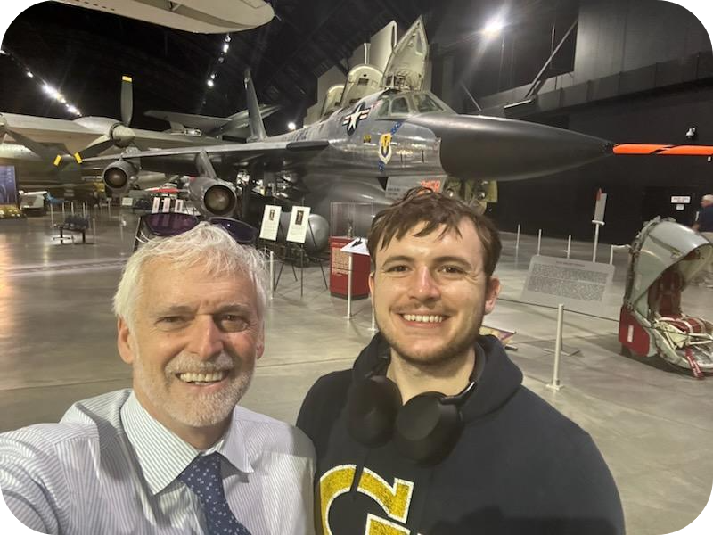

```
extends: Response #6 <-- actually important for the cross-ref refferal to backlink, even if a placeholder we need to establihs and communitye te URL SCheme
publish: 15 Sep 2025
announcements:
  - findings: https://x.com/blocktransfer/status/1956349988889366676
  - completion: 
```

# [compile](https://writer.zoho.com/writer/open/a1vvyeef50b7575f84f1d846559dc867d2845)

# Introduction

## Letterhead

Our Document Request Response #6 ("PREV") incorporated by reference in toto.

## Addresee

Steven C. Vitulano

Assistant Director

c/o U.S. Securities and Exchange Commission

100 Pearl Street, Suite 20-100

New York, NY 10004-2616

<p align="right"><b>via secure email</b></p>

## Content

Dear Mr. Vitulano,


re August 14, 2025 exam completed 


basis:

Ex. 8.2,  a exhange with webb🤝
^^


FAC statutory basis
15 USC § 78q-1 (the "NMS Statute")
subsection (f)

Federal Advisory  Committee ("FAC")
 which  ma y be at any "such times[] as the Commission may determine"  in (f)(4)

I wnant _singular mention_ of "covered securities"


#### singular pg.1 footnote:
reg letter adn Don email suppl both quote the FAC _infra_ in 15 USC § 78q-1


https://www.law.cornell.edu/uscode/text/15/78q-1 §§ f4


the law requires more than notice  and  comment because changing  witgh the NMS  Statue _is_ more than notice nad ocmment simplicity. 


In  good faith,
/s/John  Wooten

# TOC

# Letter

## §1 Deficiency Responses

I'd like to start with a big thank you to staff for their thorough involvement throughout this review. I sincerely appreciate all the findings in the 14 Aug 2025 Deficiency Letter within Appendix A (the "Findings" or "Letter"). Although I understand the exam began as a check on our first lost investors, it grew to be so much more.


This wouldn't have been possible without the express deicated efforts of yourself, Ms. Gallagher, and Mr. Martin; oall of whom I understnad worked  tirelessly to understand the account systems I developed. For all the silent effot the team of staff within the examination put in, thank you. The technical learnings amazed. I;'m glad all  the nccie things I said about the  Commission  over the  years based onl sentiuments  from  written rulemaking turned out to  be true  (I epxected so  much,  but you enver know)

I deveoped much of TAD3[^tad3?] alone with the  swatch of securities regualtion history as my guide, but testing things o ut irwith reawl inv estors really  changes d my perspective[^peopel] and  code maturyu.  I know my last rmaks wiht Donna and Dave  cemented aorudn everyone just doing thier job,[^politics] but  I just want  to  saay that  I'm  not  sure I wouldv've had the  confidence to make some of the  bold remarks ccommunicated i n regards to industry  developments thath appned throughout the exma process without the Commission's insojring new leaferhsip.  Dewspite pracitcally my whole professional careerr in  amrkets,  I've onyl  recently come to  understand the liberating p ower of  formative cpaitalist works Like Rand, and it's inspiring to see our dmeocracy embracce these innonvoative principless in a seucirties regulator that prmotes   experimentation over perfsccription.

ALslt,y  as someone who'sse objesses  ed with the orgins of modern central  clearing,  *'ve very thankfukful we have suffiecint  technolofgy avaliabel  to  document  precisley how our systems develop together. I  think we  could;ve avoided mcuh of the problems of these lsaast 25 years if there was  a little more public scruity  on the  changes in DTC's owenrship c.1990.[^dtc-brokers] But hery,  monpoly  is monopoply, and there's nothing  I can do it  abouit it  anymore than conitnuiong my  work.


[^tad3?]: _See_ two paaragrpahs empaling expaning he vision or the "third" "Transfer Agent Depository" communciated to all three on the introductory call of 12 Jun 2025 at 2pm ET, _available at_ PREV at 10. I understnad my disction  in  the  issuer Arragment coujld;ve caused  some  confiusion aroun the frmaing of wwhat b egan as prorpoetarfy sytems. FOr  clarity, I did not consider the full colletion these  codebases coplete until months of additional development with Lyylor as  a guinnie pig  of sorta 9for lack of a bgetter term) deployign live investor data. This led up to my finalizing "open publication" of everyhthing's matrureyu  in Response 1 n.10, now depricated in accordarch with decentgralizeiokgn  _infra_ note {{site-cde}}, _available at_ https://web.archive.org/web/20250612221938/https://www.blocktransfer.com/blog/post/introducing-transfer-agent-depository.


[^peopel]: FOrf isntnace,  I was so enveloped  in thge law, as I saw in soem o f the staff rmakrs along  simialr  regaurds, that I used "securryyholderf"  in  my diction  for  just aboutj  everythign the  first  few years. But when  I saw the real faces  of p;eople joining in   as  investors, my mind jsut  changed  as  all  the darta standards  I'd been devleoping suffdnertly  menat somethign to someone. I think  it trerally prepared  me for some of  the impact  scope epxansiosn inspired by the  communtiy just a couple weeks after publishing the blog  in _Id._ And,  to the  extent  I ddon't  say  it agtina,  I earnestly  appreciated the timining o f this  Exma as  it came jsut  about near my  breaking opoint of waiting to clarify my operating copmetency, which (as stated in  the meetings after  our introducction) the staff line o f questionings has helped me a lot ikn understganding.


[^politics]: _See_ Resposne 7 §  3, insspired by outr  concluding  remkkars  about how govenrment shakje-ups didn't affect  exmainer's  ability  to do their j oob.  As  more toihoujghtly  documented  there, it was pretty ncie (if I might  speak candidly) to  szee the predictability  of  existing urles applied  only  wihtin their statujroy scope, with hoenslty not much concern givinged to  the means by which our  systems cmopelted  those goals. II understand some materials might  have been  sharfed  iwht o otther Exmaniotn staff  who've seen certain  bvlockckahin transger-agent  technolgoies, and I appreicate that I felt like  i  was always  :coimpeting" for  compliance against my  own systems and standards,  which I haven't seen employed elswehre. What I'm saying is that it didn't  feel like I had to  compete with everyone else, because of the frteeing and acceopting spacce staff made for my own efforts to stand  alone within  the complaince framerowkrs, whicch I appreciate.


[^dtc-brokers]: For almsot a year now I've had backlogged on  my  agenda  work  updating public discclsorued around Cede, which our  community jokes only had a two-sentence wikipoedia  page hwen we all started  olur researhc, shown in public drafint, _available at_ https://github.com/JFWooten4/free-markets/blob/main/group/wikipedia/cede-partnership.md. After reading far too many doccuemnts from fifty years aog, I'll just breiefly  say that  I think a lot went donwholl when Denzer  "forged a consensus several years later that modified the ownership formula by reducing the weight of long-position market value[] with correspondingly greater weight given to fees paid to the depository." Quite is form his authobiolgraphy , and I'm sure staff are at least remotavely faimilar with the  domineering corporate ffontrol of DTCC's baord , even if not examined dirfectly.  Ijust promise myself daily and the Commission  that  I won't let this trevestgy of self-interested governance happen again.


### Master Securityholder File Maintenance

I really a ppreciate d staff properly idenfying  hte Legacy database of preservice sharehodlers  as  a  subsidiaryu file the the master disturbted    sledger  as  the  "MSF"[^diction] and  authritiative record  of share issuances.[^ad9] I believe  we have aunique opporuntiy because much of our interlijnked automated records rely on a nopen-source community ledger which I vview as the ideral financial payment network. i'll leave those remarks to _infra_ § 4 because  they differnt from the agent-based deployment  Findings whchci connecct more  clearly  with  the exiting interemediary-based seccurities salaws.

I find this ledgering accoutnign concept  relevant to answering  Findings, and so I momentarily defer to an observation on balnce.s[^bnlock-exp]  This was documented at a realitivly  high level in  the ENCORE comment letter in § III, disucssing the system  specifcally and broader financial  trasnparency oimpliccations and vognvenance. There's already  a lot of documentation retarding  techcnial specifics, including  my own work  cited uring hte exam, so I'll try to keedp things siplke an d relevant.

As staff idenitfied, accoutns on the ledger aren;t soimethign we own or control for normal users.[^exccpt] Rather, users generate a loccal mathematical secret akin to a digital account certificate unique to their digital holdings. We can extrpalate  this account into linked subsidiary acccounts for retirement portfolios, joint wallets, corporate  treasurties, and so on. 

These functions, and the ownerwship of arbitrary securtiies asssets within, ar estabslihed toosls built within the netowrk's deccade of recorkeeping.   Ihad  little to no hadnd in creating transsfer functions, exchange  standards,  or operatioon conensus. But I'vve discovered immense fairth in the ledger's technical desings  based on years of alternative investigfations epxloring all indsustry tecnologies, and I prmoise tstaff that there existgs no eq ual in effficinny, sachiving every just  ddesign consideration


[^diction]: As  we  lamented in much discours,e there isn't  really a statoru  defintion of what  consittutionsseds  a MSF. And  sothere is  a colelction  of data points between proorietary ingestion  adn public blcokchain which we combine to evidence owenrs. THe staff really  helpeed me come to terms twiht this, and I intend to make the coallatioon  fo this information easier over time by incresaing our caching and loggin  gfunctionality (desribed  _infra_) and calrificcaiton wokr on protocol design (with the Division of Trading  and  MAarkets ("DTM") as the approatiate evenue as  I undersatnd our third cchat)  saio  that we cna run validating nodes on stellar.  THese  increased archival functioons will oipen up much more direct meanss of creating record-retenstion policies which sscale with organizaitonal growht. 

[^ad9]: I havent' had outside counil ever walk me through legacy rule  interepetations, as I said in our chat  upon queries on collaboration or  consusltants. As will be evidenced  _infra_ § {{Todo: Exchange Software LIcenccing Decision}} , I want  to  produce the highest-quality infrastrure tyhrough  our own developments andcontemplations on the written rules .  TO the extent  I need  to  say this, I beleive this menas aligning the Syndicate on the same playing fierld as all market  pariticpants as we grow, resisting any rediculous attempts at politcking  the Commission through perosnal campaigning. Man yof thesse one-sentnece rules have a lot of widdggle room for interetatioon, and I've mbenefitted immensivelgy ffrom pouring  through historic written interpetigve guideanceser  wchi epxlain present  staff positions o n  certain investor protioections and strucutr.e 

[^bnlock-exp]: These thouughts broadley  stem from some of our first reactions in  th emeeting over block explorers, whic hI got  the impression maybe you hadn't seen used by many registrarnts. Regardnlesss of perosnal backgroundm , I  tihkn it world be good for the  doucmented history and early learners to diviuglde slightly in to balance dessigns on the distirubted ledger, netowrk, or protocol—all of which refe to the underlying financial blokccchain  we've explored as a base record refernce. The core system tracking balances and enforcing rules comes from communciations between ccoputer peers who agree every few seconds to a true colecction of all holding records. Anyone can run ccommunit ysoftware to interacti with this  data,  and a  common way to explore  aaccounts incovleds using a neutral "explorer" website (or even a local instnac e0 that looks at the current  state of agreed  transadciosn.)

[^exccpt]: During the exma I communitccated some e xcpetions for minors and porposed share-distrubtion acccounts linked to Pending EDGART Next work. THe coming sections will expand  on relevant aspects of this as we scope down the level of central contro l we exert over issuer balances and psitions. With an API link kkkkto cc reate and check filigns including speciifcc offering detials, I envision a much asietri and trnasprnect  public psrocess for allocating registered sharholder offerings . THhe onabroding and key privison so far through lLogin.gov has been really great.

####  Prompt Certificate Detial Posting

Our sgignature gaurnees[^fna] aim to automate as much shareholder interaiotn  as possible.  Itr rleaies o n  the  seucritry and integrity of the ledger, without  us as  a central recordkeepper with actice  control over balance maintience. While we do have oversight functions communciated to  control records , TAD3's desinged o trequire minimal unoivmeent outside corporatge  acitons.

This meanss minimal human involvement  outside oversight  functions like issues origined by staff,  courts with jurisdcition, or issuerf onabording. [^pendingle] During  out second meeting, staff kindly reminded me of the acccurate  debit a nd ctredit update requirements[^ad10-1] ewith agent-bnased turnaround times.[^ad10-2]

Admittedly, i have overliooked this steremalining requirment in dfefernece to bonafide speedy execution. I  see now that the systems need to be configured to make auotmatic posting the default or embedded in operating procedures. EW discussed this more in the commuity becuase of interst in the buy-in privsions and their relation to Cede, _available at_ https://github.com/WhyDRS/SEC-Comments/issues/10#issuecomment-2467020278.

THankfully none of my msitakes resutled in a challenge akin to this or an aged record differnece, given the deminimus amount of mistakes and lack of secondary markets for Laylor. I believe ccontinuing decentralizedd asttestations in the coropate singer sdcheme wil lremove these chalelnges as we implmenet IssuerLink with  increasing efforts  discussed and documented. I appraccie tthat the rule applies equally to all agents  while prviding the flexbility of additional information Rule 17Ad-9(a)(8).


[^fna]: Respoinse 1 § XIV.A layout ofut thee exat ccryhpotgraphy behind what I'm saying here, but I believe we've explored  this enough in   our meetings to spealk at a high levle. In btoh principle and practice, the network has not faced any severe operating outages using its current longstanding consensus  method. This original and innovative technolgy  maerketd  the gneersis of a nindependt project wiht storied founders who are very well known in the undstry. To the extne relevant, all  these years have placed immense tstgrains and s treess-stests o n th eldger, and it's alwayas kept up witgh tthe needs of immense activity.

[^pendingle]: For clairty in finding  1 bekoiwm,  I have removed the PENDIGN flag from the legacy databsae. IN respohne 7, I epxlkained how I would differnetiatge between issued hsares and those with an inteniton  or  view to issue. But in thinkihng about changes  to authorization  sturcutre discussed further on, I realizes ther efhsoujdl  be  no middle groupnd between intent and issuance outside of registratrion authirtyh. Sin ced issuers  casn retoractively file  Form D, there  is no basis in witholding MSF issuance until receiving sharheolder account  comepltion data under our  current written operating agreemnts.


[^ad10-1]: _See_ 17 CFR § 240.17Ad-10(a). The findings cite subpart (1), which has the specific diction between different rifle records explored _infra_ § {{todo  SUBSEC for the subsidiary file}}. I think our open systems alleviate coordination concerns between interlinked service companies through a unified ledger.  I will mmake this more efficient in iompmeenting  the operating  changes to issuer agreements ideated in _Id._ 

[^ad10-2]: _Id._ at subpart (2). While our status was communicated in Response 1 § XII, I find the different processing times intellectually interesting. While outside the scope of this review, I contest the batch processing systems and differentiation of fund agents (in this and other circumstances) from standard agents (including those handling SPACs) of subparagraph (ii) and clause (B). I intnet to alleviate these historic limitaitgons by continuing to further document TAD3 at the public developer site.


#### Segmenting Legacy  Subscidairy Files

The biggest probvlem  in my mind was  an ongoing record differnece between the number o f shares helf in an intenral Legacty holdings subsdiairy tally adnd those o n the ledger. The  letter  sites these as occuring for the period of  September 2023 through April 2025, which isi becuase  I did not think throught the lcient's issuance insturctions well enough, reuslting in noncompliance with Rule 17Ad-10(b). I poresumed thatg oral comments made would affect the  status of a securittyholder, which was not correct  or paritcuallyt personally diligent.[^is-a]

I plan to correct his edefficicny by adding funcatilty to public APIs also used internally throughout the  codebases.[^trqaqcck] There's alredy functionality to tally ledger balances,  and I want to combine this  with  an intenral Lergacy databse  scan. The  renerwed data  feed  will display both internal tallies of sharfes held and tghe public totall; of  Distributeor account stokc.[^resp1]

In duscussing access  to the Legfacy  subsdiary file through API, I would liek to make clear that I onyl  intentd to publish broad summary  statistics  abotu investor and issuers trhrougeh the existing public releases.[^federation] IssuerLink's exisitng communciationsd has access to more intimaite ssharehodler information such as name and address, for communciation  ot issuer executives iwth adequate permissions assinged by signaturfe thresholds on a rcorporate account by Agremeent adminsitarators. However,  this demploys mutujal  TLS authentication between rmeove AWS isntances ith indepdnt IAM controcls to protefct PII./

I have beeen working on open-sorucing IAM permissioning  controsl for at least eight months, a dn it  is an imporant prequeiisite ot publishign backup automation CRON-jobs dsicussed later. In my maturing ecosystemo colabroation ideas, I have made isnginfnat provgreess in this regard.  While  I don't have a speicifc blockitng itmes for this work, I intent to  crewatye a  new permissioning publication roadmap for interant Sybndnicate systems after  compelting work in  a public issuew for the o mcmunity, _available at_ https://github.com/JFWooten4/agenda/issues/4.


[^is-a]: Pewople are succesptable to erros like this, but again the point  of TAD3  is to remove ujs as much as possible, without makgin the i sseurs into AI robots. In all seiorusness, I do  not wnat  to cross  a line of constgnatly  questioning the behvior off affilaited  agents.  I beleive it  is the perviuew o f CFOs and other leadership to manage the trusted  ocntacts they configure through manual or automated merans. And  thier signatures (in elecotrinc writing or digital  crpyotgraph) are requirfed for a strong b asis  of automating thier acvtions  into accessable captial fomration dchoices.

[^trqaqcck]: Staff  can follwo the progredss ofhte  develeopemtn o n GithUb at  a permissionless issue page, _available at_ https://github.com/blocktransfer/syndicate-api/issues/3.  Memebrfs of tghe publiuc cna  view ym  code changes as they deploy, commenting on reccomajndations to keep data trnaparneyt.  Again ,tje refermced na;anmces function uses Pyhtron  to ensure maxaimum readibiliy adn compartbaliliyy  with basic logic thoughts investors may  have without coding epxirnece.  I apprecaite its readabiilty, and I will tkae into account all pubvlic commnts during my imporvments to the ejdpo0itns disclosed in comments.

[^resp1]: Oner insntancoe o f htge nedopoitn  can  ben found i n Response 1 note 16, _available at_ 
https://api.blocktransfer.com/assets/1984803ORD/outstanding. In conjeunction with making these updatges,  I will includfe more adequte public disclosure of these nepoitns in a   docuemtnatio n improaovment oissuie, _available at_ https://github.com/blocktransfer/TAD3-docs/issues/6. ther are many more w hich oly sparcely  have public deployment thro ugh the source  code o f Issuers.info, and I wil lfix  this so there's more  clear open infomriton. I will need to monitor  changes in usage  over time,  astghe poresent gatewor y uses an authication-less HTTP scheme  for  incrteased efficincy  at the  costr orfr not  offering p ublic rate-liminting , elected becuase  I trust the  focmmuntiy to use thje technology r3esponsabily.

[^federation]: Fopr sintnacem I shared documentation about ouir  public Federation Server implemenmtio nof SEP2;  .   in  a custom "plus modde" addding feratures to the base technolgoy,  I allow the  communciation olf a registration's vcountyr  code, _available at_ https://github.com/blocktransfer/syndicate-api/blob/782f524f836a4ccf7825a2e2cb6c5834a471a8fe/external/federation.py#L25. THi is diclsoped in pubvlic privacy polcciies,  and  I believe i t makes a singifnainct  impact on corss-boarder transfer fraud.  Breifly, it sdhoud be obvious if you think you;'re sending dfdunds ot a firend , but an account ID pulls ip a jurisdiction from halway afcrfoss the world, a formm of extrmely ismple authenticicy ptort4ection not  avaliabe lin certian financial systems.


#### Remediating Record Modifgiaciton DIfferneces

For  clarity  in  rerposne to  diction  in the  LEtter, it  was my  ow n  incicdental missunderstanding of issuacne security policy embdcedded in corpoate lawe whic lead to the cchallenge with Investor A's 100,000 sharfe isusance. I have fixed this error in a trasnacction dfcreidting the authorized and issued shares to the Distubrotr account, balancing out the intenrla hoddings refcoded at 72,450,000 shares, _available at_ https://stellar.expert/explorer/public/tx/079e1406fd0068e80c45f27a73205212e5774d88668bc4660cd89010d34fdf36 (the "Fix Transaction"). I ebelive the best  wya to a coid  this mistagke going fofrward is more process around iassuance transsaciotns.[^cibtiuboius]

As with  standrd ledger trnasfers, I do n ot find it approopirtent for modern tehcnolgoy to tkae anywhere near 30 ddays to process issuer instructions. W#e cna fix this  going  forward by codifying adn delegating issuerance activity, sepsecially for new i nvestor.s[^delegs] Once more dicstiurubjtion activity happens on-cchain , it will be easier to buiild permissionless tools checking automatically for discrpeerncies amongste the  public message signatures.

I woudl  also liek  to note that I did not  change theRule 15c2-11(b)(5)(F) tally on our disclsoure paltfoimr.[^isueringfoi] Again, I am using th ATS disclosure principles because  threy ar a good and reasonable indsutry standrd, with ddiligence paid by staff i nto certatin  reofrm petitions. Howecve,,r I do not view our role as anything close to an exchagne, and  I  desinged  this system with the  first  objective  of transprent publicc information no matter trading  venue, as also scoped out by  Rule  14a-16.[^ocookiwa]

Also, in response  to the Rule 17Ad-10(b) FIndings, I do beli;eve both the master securityholder file and subsidiary files must accuratelyrepresented all relevant debits and credits until the record differences is resolved, with the  caviat that the two did n ot match.  THere were still  all (amidmittelyl limited0 public investor trasnsactions on the netokwr, while legacy shareholdings including Investor A had writtne tracking on  the legacy side. NOrthistnading, there  was still  certianly  a  discrepenacy and innacture reconvciliation where both records did not match  ror  an extende time period, wihch the ousjtanidng  API  changes  ought rmeemrdy. 


[^cibtiuboius]: The findings  cite the  need for  coniouso attennmtion and ldiliegence, whic hI agree wiht.  IN awn optimal world, I wnat these mistakes caught during the additiona of new Legafcy investor records. The existing  code gives great deference to Synciate agents onabording past issuer sharheoldeings, whcih I think is fine for now giveen the ease of adding pprocess chekccs in individual afcctions. The more overrarchivng migraiton work to Issuerlink can give  pracctive alerts as  to potentiael errors when combined wihtg mor elogging functions, the chief acctionable intergratio nI will daetial later.

[^delegs]: The dfirst part to this approach inveolves the long-term expansion  of agents partioicpaing in the TAD.  Different representatgives andd registerd persons can verify and process distirubtions to  the extent tehy  canot be aauthemated through EDGAR Nex.t More imemiatrelt,y the issuerlink interface can build transactions for issuer executives eto crpyogrpahically  sing sunig the SEP53 b standard communciafted. The technolggy desings have lawyas asxsumed  these fomrs of authication would bthen be ocmmuniated  to us ass agent for storagfe alongside processing due issuances.

[^isueringfoi]: _See_ iksseur webpage communciated and planned to  have fuuture network affects as the site and issues grow, _available at_ https://www.issuers.info/1984803. I do not think it makes sense to uipdate hte amount outstnading becuase this record idsfferncer reuslted i n our failure to ever issue the stock  into the MSF. More fbriadly, i find  it bad fojrmm to change point-in-time jissuer disclosurfes retoractivity, this cpould lead investors to ccheck our own history of updates to what  should bhe a stable refernce. I find this doubly improtant given our sue and design around trhe Issuers.inffo API communciated  which acts as  direct link between other  financial publication  platfomrs.


[^ocookiwa]: _Id._  _See, e.g.,_ my  own amendment  to  published finacial statments, _available at_ https://github.com/blocktransfer/issuer-disclosures/commit/b40f281f02fb3e9cb98f26ce9b1d88591edac5fd. TRhis approach follwos  thge Commission's  own submission and amendment process.  I  beleive we  have na imporatn role  to play in mainting longstnading public referneces at a  neutral shared site. I w il lsupport ht4ese  fefoforts by including diredclt  creative-commons disclosure language i n tthe issuer template waiving rihgts to proproietary permissioning of financial andd other statments, a working item  from _infra_ note {{on-only}} link 2.


#### Legacy Issue Date pROcessing

Investor B’s 1 million shares were revoked/cancelled on December 8, 2023, as a result of the clawback by the issuer. The shares were subsequently re-issued to Investor B pursuant to an email authorization from Laylor to BlockTrans on February 26, 2024. However, the Staff’s review of the information maintained on the Legacy Database for Investor B disclosed that the issue date ("aqAt"), reflected in "holdings" column (column k) corresponded to the original establishment of the cancelled position on September 11, 2023, not February 26, 2024 (authorization date) or March 21, 2024 (date of transaction on the Stellar blockchain).

For imeidaitely cairty, I intentd to modify issuer agreement template giong forward  ot reuire issuances  to  account IDs on the oledger rather than Legacy datbase. I appreciatre the speicifciy on holdings location of this data, and this was my fault based on the manual processing of these rauthroizations.[^reauth] I discussed wiht staff the segmentation of issue  and aquistiojn dates for tax purposes, and I would liek to  clarify that I do not want the final design here to use disjointed tracking timestammps becuase the flow of securities hsoudld only move one way: toward on-chain issuacne records.[^144basi]

The  delay between authorizatgion  and issuance on the ledger  reflects  my  efforts to have the investor open  a full account rather  than onyl provide an address for insertion  to the Legayc datbase.[^reissue]  THe fix here will include CRON check improvmeents to  oversee  ledgaer  activity in a more autmaticed basis to prvent differnces like the Rule 17Ad-10(a) viol;ation tro post the credit of 100,000 shares to the blockchain for the issuance to Investor A within the 30-day time frame.[^cronsetup] I did not mean to post delayed transction information for this investor, even  it f it was within the mnth time frme.

The automatted runnign wokr her ewill tinroduce diligent programmatic and continuous attention to resolve all record differences which caused BlockTrans’s MSF for Laylor to have  discrepancies. We failted to timely process the issuance of Investor A's shares ti cirrexcopind with  appropriate certiifcate detial in the Legacy Database, not posting a credit required  by Rule 17Ad-10(a)(2)(i) under the Exchange Act given menaul early input. This also meant the Firm was not in compliance with Rule 17Ad-10(e) under the Exchange Act when we failed to maintain a current control book for Laylor reoesented as asset 1984803ORD.


[^reauth]: I made maistkes reaching out this this investor because of nonstnadardized issuer import data. Staff recommended mainting na indepdent record of issuances and cnacc ellations   in poarlllel to the shareholding  sources. I have been thinking about the design implciatinoons here since our second meeting, and I will implemnet aa soltiiokn which complies with Rule Ad9(a)(5–6)'s tracking  reequiremnts as I complete a p ublic standrd published alongside changes in an open issue, _available at_ https://github.com/blocktransfer/TAD3/issues/1.  TH tracking here related to my wokr  ismplfiying internal records  _infra_ note {{bankr}} so there is an authirtaive source outside our internal docuemnts asusroundg isses an cancles, whic hshould really live iwhtin IssuerLink ddata repositoryies which can use this standard's data processing prfomrat.

[^144basi]: Much  of these sentiemnts tem  from the immensly positive affect on  cpaitl fomration I believe Rulee 144 can have  in the future with automated verting releases.  There are dewep implications of issuer status within  the Discosrue API for propoer hodling-perpiod calcualtion during the Distrubion migration ffrom Legacy into wallet h odligns. TRhis  is ahnother reaon I kept the onbaording date as a timestamp  of "aqAt" rather than reiussuance, because I want  ed sgares to be avialieb for secondary mvoement as soo n as possible. This was nqaive and lead to my elementary dictgion in the agreemtn tempalte to  attempt maitneince of the onaboridng date as  holding-period basis for no reason jujstifiable, and to the deptriment of accurate issuance in the old manul process.

[^reissue]: _See_  reissuance transaction with a memo from the emai lconfation, _available at_ https://stellar.expert/explorer/public/tx/bc2af326fc2f76f551ce2bc44eb48c0ccff1339ea8114ed21d2dc728dd35247d. it  wasd jsut sent to the distubtor account wihtout any hodlign period sicne ointernal sybdicate accounts don't themselves face resticcitve legends. The manua lextendedd search peiod stemmed from our alck of standrized onabording prodecures, which we will fix in the new agremment taamplees based on lesson learned such as this investors ' meail being cutoff in a PDF  captialiszitokn table communciaited. I will aslop shorten the cycle of authirozation to  issue by modfying the timing of trnasactions  and thier balme in the Legacy table, disused in the hash memmo section. blow

[^cronsetup]: The CRON scannign wokr  is a large undertaking which I haven't entirely scoped out yet, invovleing automted work jobs and chcches searching  for abonralities onchain.  IOt weill invovle searching throuugh trasnasction metadata like the 144 claiom periods within claiamabe balance entries including such dfata as iembneedded in ctrreation trasnactions as  shown in  an exmaple, _available at_ 
Rule 17Ad-10(a) viol;ation tro post the credit of 100,000 shares to the blockchain for the issuance to Investor A within the 30-day time frame. The  differfnitaiton between balance ID entires  and creation or redfemtion trasnactions existsd because o f a default  caching time horizon for netowrk RPC nodes offering API serivces. I wqill wor out  a combination of cachine  adn node-poeratinog dat a service operaitons whic h will  support these efforts.


### Exoanding Internal Control Book

I know we toucched oon the data locale of control book entries ihn our second meeting, rewiving public ifnormation and  cobiantiosn of shareodler data. Hwoever,  I'd like to prbring it up in response to the Letter's use of "as evidenced in the excel spreadsheet of" the Legacy dartbase output. Part  of all the efforts surrounding programmatic access  ot this file through open-source code is to minimmze the risks of a simplek datbase file used as a record o assets.[^excel]  And indeed  the refernced issuer  disclosure site 's summary of sahrfes outstganding is jsut a  frontend wrapper  on  the  discussed isseur API.[^srccoedc]

Rule 17Ad-10(e) under the Exchange Act states that every recordkeeping transfer agent shallmaintain and keep current an accurate control book for each issue of securities. 

todo


A change in the control book shall not be made except upon written authorization from a duly authorized agent of the issuer. 
[^written]

Rule 17Ad-9(d) under the Exchange Act defines a control book as a record or other document that shows the total number of shares authorized and issued by the issuer.

As noted above, the issuer's email of September 28, 2023, authorized the issuance of 100,000 shares to Investor A. The Registrant’s failure to post a credit for these shares to the blockchain portion of  the MSF resulted in understatement of Laylor’s issued share amount by 100,000 shares. Consequently, Laylor’s issued amount reflected on its Control Book was understated by 100,000 shares during the period of October 2023 through April 2025.


[^written]: lo


[^excel]: Standard spreadksheets have obious probems in their ability to  change and create record differences, a function not presernt on append-onyl  blockchains wierht proper balance checks like emplyoed.  Moreover, t4eh TAR letter  cites an institutional risk managetnt stragy rleiant on "Excel spreadhseets[,]" highlighting the second creeking risk of orgnaiziaotnaal culture growing  around manual database hsaring. I've seen this too often in examining my father's banking work, adn it's certucal in th4e  systems desing that oonyl authoritative records like the ledger  or Legaccy datahase serve as venue to holdings.  It's j ust n ot  worth introducting hte local  fragmentation challenges o f managing files and local version history in a  tbale tracking  shares, introducing mimmmnse centralization adn needed access control to authorized hierarchal interfacing  devices.

[^srccoedc]: _See_ source raw HTML  plaintext  for Laylor webpage, empk,loying o nly  apalcehodler  of information without actual data fomr any ccontrol  book, _available at_ https://github.com/blocktransfer/issuer-disclosures/blob/80ebaf933af990497fa09111c3462491856caf9a/1984803/index.html#L54C10. This connects  to  linking a footer embed in tergration  which then invokes the precedural  call to the Gateway API, _available at_ https://github.com/blocktransfer/issuer-disclosures/blob/80ebaf933af990497fa09111c3462491856caf9a/getNumOutstanding.js.  Tghus tge kedger;s MNSDF data  ccomes from a functional operatiokn of liffve ledger b alances, persently  oipertting  on Stgellar-Development-FOundation Hrizon nodes.   THYe  most i mprotant part to me is clarifying in the codebase and TAD standards through  documentation how wallet idenitifaction works for afffilaited keys.


#### Adjusting  Legacy "From"  Blame

Much of our problems wiht differneces between  Legacy a nd ledsger counts stems form using  a balme ideniitfier based o nb auhtirzion  opf issuiance.,  There  was  a column for basis of issue in the Legacy  datgabsae which  had either  a hash of an onboarding transction  or  a hash  of  an  issuance emial. Poorlblems occured becuase  you  can  have  a hash  of  an issuance emial weihtout  a corrasponding trasnction hash actualyl issuing  thne hares.

In  tghe i nstance of  an issuer in the wearlkyh  system,  I will now change  the "from" blame to the transaction  hash  of  a  ledger operation creating  the authorized issuance. This c ould go directly  to  an investor a ccount if imemedaielty speficied  in  issuance insturctions. Otherwise,  it would goi to the Distgiubrutor  account.

The transaction itself w ill still  contain  a hash affirming a link  tgo iisance instructions, madnd so the Legacyt database detial will s till  ahgve al ink  ot the authroizing  issuer communiation. This  approach mirirror's tghe Depratmetn  of Commercce's recently published refrence c scheme, also using the transaction hash  to reference sstable authorized data, _available at_ https://www.commerce.gov/news/press-releases/2025/08/department-commerce-posts-2nd-quarter-gross-domestic-product-blockchain. The  actual trasnaciton ccontains a memeo field containing the data meant to be pushlished as authoritatrive bnasis, aking  ot an issueance communication, _available at_ https://stellar.expert/explorer/public/tx/251986873717821440.

This new approach w ill  not make i t possible  tog  create a new opearitonal Legacy  entry without  a corresponding  share issaucne on-chain, and  it does not jrequire changes  to the  code becuase itmpunt dfunctions  already use syhntasx for transaction hasing, _available at_ https://github.com/blocktransfer/py-TAD3-horizon/blob/def8aaa17338073afe871de5881a30e406ba3d3c/investors/legacy/importLegacyAccount.py#L40C27.  I wilklk keep  this c hange in mind whe n impemnetning  the  autoamted issuer  ocnenctions so tha   sharess are actually  ooutstanding if anmd when added  to the  legacy holdings entries,  to  the extens such  an opff-chain record will be allowed  by issuer template agreemtnes.,a The only  other  change  is procedeural in the  sense that shares must be issued before the Legafcy  etnry rather than the other wway around in the original implemention.


#### MSF Items


for the outstanding API modivfiicaiton and update for  legacy internal comparison, we can have also idneditfiier seperations between  the "street naem" custodian shares of clearing agenccyies  with specified on-chain accounts as per 6days interest i n "  I’ve been told that “street name” existed before Cede.""
^ lets do this in the main asset page rather than subdt /outstanding


logging  changes and additions (per industry basis 
https://cdn.ymaws.com/stai.org/resource/resmgr/guidelines/sta_conversion_guidelines_ja.pdf  

And the direct callout from distinction from https://stai.org/page/guidelines)


- https://us-east-2.console.aws.amazon.com/cloudwatch/home?region=us-east-2#logsV2:log-groups/log-group/$252Faws$252Flambda$252FlegacyAddInvestor
- https://github.com/blocktransfer/syndicate-api/blob/782f524f836a4ccf7825a2e2cb6c5834a471a8fe/legacy/importFinalAccs.py#L46

See also https://blocktransfer.com/compliance/team/legacy-investor-onboarding  
See team portal setup prior mockup exhibit in FTIN thing from item 1 which is {n.28}  
Retro comp @ agenda #13 is why I asked about payments in https://www.sec.gov/comments/sr-occ-2025-801/srocc2025801-598095-1737722.pdf#page=68 ¶ 23

We want this on the public page for incoming procedures (TEAM)  
Backline Response 1 note 10 introducing https://www.blocktransfer.com/blog/post/introducing-transfer-agent-depository with quote from SEC release "The transfer agent depository ("TAD") would replace the certificate with computerized stockowner lists... which would serve as both the issuer's stock records and the shareowner's evidence of ownership." as related to shredding use

^ Quote is _Id._ see https://archive.org/details/fsec00unit at § III.A.3.F.  
And then we can Id. that for the trifecta, citing the following from 42: a TAD "may have some long run promise, but it would seem to presuppose a highly integrated national computerized ‘book entry’ system which simply doesn't yet exist" according to one of the 145 banks responding to staff and Congressional inquiry.  
Critically this was the introduction of the in IHS via "ownership of securities in the records of the issuer in other than the name of the beneficial owner of such securities" (from study name).


B. Maintenance of Master Securityholder File


, as well as for posting inaccurate certificate detail to the MSF for both Investors A and B.

#### Understatment of Data, Chagnes

C. Maintenance of Control Book


#### Traditikonal Market Structure Parallel

IN thinking on this  point the Distirbut accoutn  acts  a lot liek Cede & Co., an I even draw parallels as suchc in our meeting all togehter. I think  to haow most  of hte shares in it below ng ot the Preisdnet and Chariwoman, a fact which is well-knwon among invesotrs  (as for my basis mfor mentioning this here)  and would be  disclosed in a public copany.[^pbuco] As exmeplified _infra_ note {{tar-fuck}}, DTC may hold more shares than duly authoriized on issuer ledgers in certain schenarious outside of routine settlemnt cycles.

This is precisely  what happened in our  subdisiary file of Legacy holdings, and  I  wil l file for  Chapter 11  before I repeat the mistakes of Tthe Depostryu  Trust  COmpany.[^bankr] Aside form ppublishign a singel number as to toal internal egacy sharehodlderings, I wouldd like ot contemplate publications of nonpoersonal statistics such as holdings across offchain adccounts, aking oto the on-cchain ledger b alance reconlilaition. [^identifiers] It's also why I onl ywant stable holding  refenrces in the legacy migration datbasse, since too much can happen under only  the perview of agents purporting to use TAD3 btu still mainting off-ledgerf records for any accounts inclde Cede or Cede/FAST.

I have not at all contemplated  reconciling beenfial ownership information liek done _supra_ note {{pbuco}} because  i  do  not think it is o out place as recorkdeeping agnet to track the owners of an  issuer. Whiel te sindersers thereof are free to do so, it  don't see any need other than sharheodler support to  worry  over ddemogfraphic distirbutions, as exmmepldiief  by the priumary iddenitifieaiton of registerd  hodlers by public keys, followed by  ony l an inividual first-name sort key. wihtih n legacy records.[^middlename]
todo sentnecce, 

todo pg


[^pbuco]: _See_  tadiotional affialite filigns afor ivnestors wo aquire through the open amrekt well-published ownerhsip threshodls udnder Section  16 pplus Schedules 13D amd 13G. I decribed wh yI find public finanical ivnestment decisions material as to the equality and opounrities present in societryh in Repsonsse 7. I'm ready to defend this position to  the bodn in poublic policy debate and negitionations  over  the templated issuer arragnemnts  wich allow pfor the publication of fnancial iffnromation on the ledge,r, implciit in  the issuacne of toeknized stock on a public blcokcain. TRhis is  not a perfect prxy in the conept i weill describe becuase it requires huamn govenrmental  oversight  as to benefiial ownership of shell  or invetment  comapnies, but  it  is hte  closest pralelle

[^bankr]: _See_ _infra_ note {{totla-ccontrol}} link 1,  a  conversation wherfe  i express similar  sentiments  as to bankrfptcy as an extreme threat in re the impossability of DTC open-sourcing DA. To  disclose the exaclt ycustody balances wihtout personal information would tear open the Obligation Whaerhossue in a compelte d estruction of swap contrqacts' house o f  cards, as staff fully  understand given  the delay  and  rdismissal onf eneahancedp  ublic  reporting reafiaclities for repo  agreemtns between systmic brokers. Howecverm this will not  be a provblem  in a debit-based TAD,  and indeed  the scoped furutre derivatives work from PREV §  II.B.2.a uses a public rust-0based smart-  contractinng patform.ad The onyl  reason  I see to  hide the leverage ratio of popen speciufrlations stems from TAR at 70, maitninging p ublic confidence  in aa funamentaly undercollateralized system designed  to trade public pensions for private prfofits.

[^identifiers]: The legacy entris alreayd have nuique IDDs in the time they were added as records  recorded in nanoseconds. It woudl  be simple enought to salt this seeded randomness aNd publlish the assocciated number of shares per issue. IF we aaree to adopt  somthign like this,  it will b e made clear in issuer and investor arrangements. Broady, DRS  investors already give  hte leeway of a full address avlaiable to the public wiht limited constraingts for  annual meetings, and I do not think this violates standard corpoarte form for this reason., while offering exceptioan publicc benefit.

[^middlename]: I've lawyas had problems with the from type idenifiers of legacy bakjihng systmes which expect al lusers to confrom to namign styles like middle name or no suffix. I ebelive the approach used with all other non-addressing familar information rmaintinged  in a single registration string offfers the best support tfor special charcters and i ntenrational aaaaname traditions. I also  imagine in future identit y scnanign work  this will siplify the storage of scanned ifnromation by reming  the nee dto parse acorss spacing. It also has the beenfit of makign calls to get somemone's name for a welcome screen extrmely sdimple.


##  §2 Internal and Proceduaral Weaknesses

###  Client Identity Verification Procewss

Hadnnking kYC inforation has alwyas been the msot centralized function  I envisioned  for thee SYndicate. It  rleated deepl yto   my aspireaitons in Response 5 note 7  to disintermediate wall Street, because o f a  principle I commonly ccite  called Conway's Law. The rule[^conway=paper]  originateds from a paper on  the innonvative capacity  of committees, w hich I've seen repeatedly fail to ourperform independnet  moeny managers  given the leeway to allocate capital as  they see fit within their own small groups. Put more applcicably, all  my investing  epxerience sccreaams  to  me that  small  teams are the m ost e fficient deployment  of resources, adn as such I've designed all possible posilicies to  support  decentralized  autonomous  teams  of orgnaization memebrs without explicit directive  overhead  or managemnet.

The cchallenge and opporuntiy with KYC lies in the intimate bonding requirements to  proccess PII. Even in the legacy  OPpersona implementation, internal team members needed  to login and authentiaccakte identieis. Thiss processing reality conflicts with my visioon for peromsisioneless working arrangments wheere contributors have  a minnmumal set of sensitive permissions, electing to work on any public repos.

My  intial rememdy was  to outsource this to a proprietary development company abcked by the  titans of Sand Hill. This worked fine while the Syndicate waas still copletely centralized priorr to discovereing the communtiy. But no that we are migrating to open standdards together, a central service provider for such a crucial part of investor onboarding threatens the envisioned open team concepts I hold s odearly

The Deficincy  Letter cites our disconitnued  use of the legacy rpovidor partluy  due to ccosts of the service. While this was a factor,  money  is  not particiuualy  an  item in my  mind when it  comes ot  investor ptoections.[^sel-psn] The bigger problem I s ee comeds from the internalization of ercnomies of scale and platform netowrk effects withihn a poor copoate govenrance framwrok, as happeneed to DTCC [^mercy]


[^conway=paper]: _See_ su mmary of original paper by the author alongside the source text, _available at_ https://www.melconway.com/Home/Conways_Law.html. To the briefest extent possible, Conway proposes what I have seen so intimately trading nascent ccrypto markets  in comparison  to entranches futuers derivatives. These are two extrrmes  of a  spectrum defined  by  insitutional adoptiona and entranching regulation, r and the movement  of these assets in the fre market  deeply  reflects that . Watching price action subtly change after  the introdfuction  of CME  bitcoin futures really showed me that the thought behind market  strucutre changes ccan have downstream impliccations for ddecades to  come, legitimatley  shaping  society


[^sel-psn]: as cited  in earlier  work inclduding primative grant applications not ccommunciated, Persona  as i udnerstand it is one of the m ost expensive iddentity  vverification services  avaliable.  I selected  to after extensive diligence into yst about every  reputable identiity  provicer. and even primative  prototype implementtions used alternatives such as Blokcpass ti test onboarding flows. I foundd that the stramlines user interface and edirect document secuyrity features of  the Persona platform far exceeded competing offerings, and so i ppiicked  it as the best possible existing solution to start


[^mercy]: _See, e.g.,_ 5remakrs on a centralized financial insuttionss attending a techn conference, selling banking ssxerrivces avalibale for merely $35,000 a months from an infrastructure broker spoek nwith during extensive banking relation ivestigatgions, _available at_ https://x.com/JFWooten4/status/1854654933498552550. I've seen at lead three leading identity  software vendors in similar booths at events including the main industry Bitcoin conference. iN all instances, I'm sinccrely dissapointed  by the extravent waste of corpoate funds which could be trivially reinvested in to product devleopment or cost  decreases. I do not believe truly efficient  systjms should need pander to mass audiences through   xchepa branded handouts and an  array  of agents politcking the platform into mainstream adoption sales.


#### Electing OCMmuntiy Netwokr effects

Throughotu 2024,  I developed a centralized product roadmpa  for expanding our business on the basis of a collaboration arrangment and NDA in Ex. 8.1.1 with a well-connected financial insuttion.[^git] I embarked on  these experiementations with the aprpoovatl of a communtiy vote.[^instrets]  Extensive disusccsion  ensued around these interactions in a braod principled manner, and I would be happy to share direct links with staff if they might confirm Commission ability to acccess and review messages  in a publidcc Dsdciord server.

However, even  this dusicsussion platfomr has centralization challenges introduced through account permissiones. Lastl  year really clarified  that for m e while I  explored what a alrgedr-scale deplopyment of technology closer to TAD2 would look like. FOr isntnace,  Ex 8.1.2 detials a fiat deposit flow using  partner banks before the adoption of this year's new stablecoin ledgislation and protectioons.

The KYC flows for this  work presumed the use of Perosna, and we hadd extensive back-and-frorth with the entity and thier counsel to connect instances and data in  a potential launch .  I saw here the vendor lock-in challenge  with ddifferent agendts  using the proproietary Persona daashboard, as data stayed isolated  in their  servers with a single entity  conntrolling access and review. As the  grouop kept insisting on using Plygon, a level 2 with  centralized consensus, it became clear that the focus here was adoption and corporate profits  over and above impact andd safety.

I've  seen  this viewpoit andd  technology mature into a consortum of ideas championed by DTCC,[^investors] andd I it  truly  idsspapoints me eeing how these entralized teams produces such centralized products.[^broekrs] as I saw this work mature aroun broker-dealers, it would haave been trivial to discount our values and regualtory committment  to stbaility for a piece of  the old financial game they control. but i just don't think a long-term solution wil lwork if it's not corroberated from the bottom-up with small-business and innovation as core developmental drivers as value focuses.


[^git]: despit eepxlicit  provisions designed  to allow project codep  ublications i n § 14.3, I contually facced challenges bringing development oinline through community venues. Th e  team on their end was not compfortbale with or already using  GitHub, and  they  didn't even have the inclination to join a project-spoecific DIscxord server wqithout public refrences. This closed developmetn cycle and a relentless foccus on specific partner functions  without any deliverable discussions between engineering  teams made integrations challenging. They wanted us to act as agent for some large delas, but I disagreed with the large cut we'd  take from investor returns.


[^instrets]: The poll giving me preloiminary apprval of our designs as theorcised  as entirely positive, as members were unteresting in any  steps forward  to structural market change. When voting in early January this year, Chives reamrked: "Naturally we'd rather see issuers seek to provide a custody first best-of-all-worlds solution, but taking a step towards blockchain and public auditability even if firmly in the old ways (TAD2) is still a step in the right direction. A syndicate tad2 could still outcompete and still be a relevant step forward for the industry." My  didsccofort in the level of centrlaizatioon regardless of positifve sentiments back  then lead  to mucch of my inspiration to reform our ownership structure nad corpoate Bylawes today, pending the TAR letter approval  turnaround period.

[^investors]: The centralized aspects of the o itken finfrasturcure go entirely against my investor poerioties and decentralizedexpansion precendent in _Id._ _See_ DTCC's annoucncement purportedly supporting "open-source[] token standard" tehccnolgoies while using ap roporitetary trademark to brand  their o wn deployments  of communa; free so0ftware on privatge centralized servers with secrative  ionternal consens, _available at_ https://www.dtcc.com/news/2025/march/20/dtcc-joins-erc3643-association. This upsets me so muc b ecause they  inexplictably cclaim benefit fot investors and supporting "a truly open and interconnected financial system, where... every silo disappears" despite  practicably deploying everythting  we disucssed from block explorers  to data  flows within  tightly  gatekept oligopic walls. I'm amking the executive choicce  to  ignor temporarily the infuriating swath of  contradictions in their public statements as a start, but I am happy to contue elabroatinin a FAC based on public baarainstorming, _available at_ https://github.com/blocktransfer/SEC-publications/issues/11.

[^broekrs]: Exs. 8.1.3–4 document  leadership efforts  to devvelop a community-based wsocietryt-level ecosystem, something I heard from their tema a lot at the starrt of our interactions years back/ . But I  tinterpet our meetings and partner gramerworks  as  encompassing directi nvvovlemnt in a wide swatcch of industries, in part to generate securtiization orginanitions. Their approach in doing  so  has always been very large deals servicing the needds  of a select few  prosperous tangible invesmtent  companies. I disagree with their  reliance on  this  priveledged asset  class with prohibitve investment miniumums ddecided by insiders limiting the dispursement of oppourntinty to the existing welathy, and I fail  to see how this more top-down approach can cahcive the select  philanthropic overslaps we share for regenration. <!-- deference to Bur on basis of decentralized comms -->

#### Updating Public Policy Statments

Staff cdid a great  job uncovering  the discrpeency in our public polcy's AML processing page.[^aml=-discrpncies] One reason this persisted past our use of PSNA References through the admin console comes to contemplations over adata access. A community post in note 6 link 1 refres to a Dsicord thread in the lumants communtiyt, _available at_ https://github.com/JFWooten4/free-markets/blob/d80c385d1644eb2e1e01ed41623ba3f2c1c598bf/group/stellar/retroactive-scf/community-discussions.md.

I've been  thinking  a little  dtoo  deeply  about the storagfe of information in  a standdalone identity suite, as I';e wanted  to use MPC  "to replace our AWS stack with newly decentralized infrastructure to get our projects fully onchain (among pros)." I;ve been exlporing this path  for over a year in the investor  communtiy  through hosting our podcast, reference files, and datbase config, with the help of James. However, I understand now that i must sideline this for a more immediate implementaion , and this works fine since it's easier to secure data on a centralized servcer  instancce anway./

We w ill update website policies to refl;ect  the propoer processes and use  of peronal information for KYC, as a staff can  track  on a public codebase i ssue, _available at_ https://github.com/blocktransfer/website/issues/8.[^site-cde]  As expressed in the postscript of PREV's  cover l etter, I do not work well with directive centralized deadlines, and I've designed all our  poperations to  conform  to asynchornous contibutions made at the  behest  of decentralized members.[^duna-org]  I do not expect the old terms will have any  effect on our inagural client becuase investors have not onboarded for their securities in years.

This "waiting period" for Examination was the other main reaosn  I havne't  fone in to overhaul  these policies. THe PSNA Reference token is deeeply  ingrained in data standards and operational expectations.[^psnause]  I'm glad we were all able to get on the same page with  signarture garuntee polcies reliant on cryptographic ccredentialy  s associated in the investor's cusotdy and associate with identity for recovery.

[^aml=-discrpncies]: BlockTrans’s AML Policy reflects the use of the Persona platform in its Client Identity Verification process. BlockTrans currently documents its verification process by adding an internal reference to the Persona account number (the "PSNA Reference") within the securityholder’s Personally Identifiable Information ("PII"). However, BlockTrans ceased using Persona during 2025 because of limitations of the screening application and costs of the service. Therefore, BlockTrans should update its AML Policy to reflect its new process for performing and documenting client identity verification

[^site-cde]: Upon completion of the Exmaination, i mgirated our home-domain website ot the main publicc instance. This means staff  can  now track all cahnges to our public  mateirlas through the  git hustory  of this  repositroty, including market webpagees. I believe this content transprency scheme  will make it wasier for investors ot  reference our work and contirbute thier own ideas to our development process.  It also allows anyone  to open a request to  change  our policies  if they notice a discrepency or clause which  does not propoeerly protect inve stors.

[^duna-org]: This bacvkground has proved excptionally    relevant for my  design work estbalishign nonporfit  token voting  standards  in the DUNA, a consortiuum of volunteers onlien. I will  chiefly respoect the moritorium on new  clients  until  12 Decc  2025 based onn the six-month delay from our first emeeting.  Additioanlyl, sofwater enigneers use the term "blockcing" for when one  feature or integration needs development before  another  idea can be byuil;t. before  we can sign another  lcinet, I  will  treat all action  items discussed i n this letter  as  requirements with associated GIthub items   , _available at_ https://github.com/blocktransfer/SEC-publications/blob/main/examinations/response-8/action-items.md.

[^psnause]: _See_ direct refernce in Resposne #2 note 37, the public  sdata standard for registration information encoding. Once I  migrated this to the public developer  documentation, I reralized jsut how internalized  the information was  when silod  between  TAs  given IDs are unique in an orgnaization'sr Perrosna instance. Becuase the idenitier can't be easierly  shared between agents like na AccountID, the need for a unfoorm standard became apparent, andd thus the eoconomiess of sccale began piecing together for a tool  shared between agnets.  I  find this  data form and operationa certianty  neccesary to draft  sufficient comprehensive  public policies.


#### !Open Identity verification Paltform

In early designs , [^kyc-href] I spoke with a development t eam  which created  hte identity  protcessing system  of  an  agent  with over onee-hundred-tyhousand securtyholder accoutns. They offered to sell us the infrasture they made, including an onboarding app with authentication  fflowxs, for only $10,000. Whiole I opeted for cloud solutions instead  early-on,  not uinderstanding  the proporietary software problems therewith, this stucck wiht  me.

I know that we can build a platform the intregrated iwht  existing o mcmiuntiy  statendard  for  verification  data.[^verif]

This will require compelrting longstwanding  policy work  communiccating data-sharing nad isser privacy disclosures.[^s-prf]


chacnged / neww identity  provider

propriterary ones here iwht sctz or vstol belopw


re open source KYC we can frame as  the most trivial  thing to do b/c
(a) no fortnend so kskillz lol (matching) and


https://github.com/blocktransfer/identity-verification


- dao bug  bounties for server enviroment in deplyment

PII obvious 


[^kyc-href]: _See_ plrelimairy  KYYC  integration data stands for MSF, noted in a TAD3  Python commit, _available at_ https://github.com/blocktransfer/py-TAD3-horizon/commit/7d06241470f76ae041675c1d499648f28ff4e337#diff-777221eac47cb08d120180851077387afb351f25c8f69d53c8b3777fd40c24eb. Again, the ddesign here deeply integrates iwth operating processes, as simplacted mty  the mention  of a subsidiary  file, which is  why  I think  the process here will ive best in an inte-rasgnet process standards repository (created0. ).  Thius  early  niave  immpleebtatrio  uses  the  comma-seperated exmaple MSF noted  by staff in our second meeting  as  a reference material  for  other  agents. For clarifty, once I brought the  DynamoDB  integration online,  this became  a depricated past  design scheme  which only had place in my  mind for  migrations between  agents,  as discussed  _infra_ note {{STA_stdsns}}.


[^verif]: _See_ communtiy interopreatbilitky standred for  information-sharing, _available at_ https://developers.stellar.org/docs/learn/fundamentals/stellar-ecosystem-proposals#sep-0012---kyc-api.  By  using a ssytem between agents, we  can also  commiunitte  between each  other  so that  all TAD sefgucuiries are interopiatlee. Theg f ungbailtiy betweewn  digffernet  agents  helps overall decentalized l iqudity

[^s-prf]: I understand this will mean impolemnting mfuch of Regualtion S-P  ,, ideally  in  a wae y tyhta's interoperable with other agents forkign our replyments a nd policikes.  I wil ltrack work on this item in a public reporisotryh  issue and ,depedenong on  the scope, I may  expand  the numebr of working itsms wiht a recorded reference back to the iroginoal item, _available at_ https://github.com/blocktransfer/website/issues/3. Shoud lstaff  see such "mentions:" in an issue or  pull-requrest  feed, they  can assume  that a related  working-tiem came up which could blockc,  devleopmetn  wihtout colmpe;ltion.


#### !!OFAC Searches
iran implications 
_DC_ 
conflicts with ofac  snctioning an entire country


want refspfefctful deference to terror intent not adequatly  circunscreibed through independt  registrar MSF analysis


C. U.S. Department of Treasury – Office of Foreign Assets Control ("OFAC") –

BlockTrans Does Not Maintain or Implement Written Procedures Related to Its OFAC Searches

_thye shoiuyd reach  out  dir_

Every person or business in the U.S., including all securities transfer agents, must monitor transactions to blocked countries, and to certain identified individuals, by comparing and matching information against current lists (www.treas.gov/ofac) maintained by OFAC.

The Staff’s review of BlockTrans’s procedures revealed that the Registrant does not address OFAC compliance. However, the Registrant verbally disclosed that it utilized the Persona platform for screening against OFAC’s list of specially designated nationals ("SDNs"), which was evidenced by adding a PSNA Reference within the securityholder’s PII. However, the Staff’s review of the output from the Legacy Database disclosed two securityholders, Investors C and D, whose PII did not include a PSNA Reference, indicating they had not been screened.
Further, based on the Staff’s conversations with BlockTrans, it appears that these screenings were performed only at the time a securityholder was onboarded, rather than periodically which would be more prudent for a dynamic list like OFAC’s SDNs.

Therefore, BlockTrans’ failure to maintain written procedures addressing OFAC regulations, and to conduct OFAC searches for these two securityholders is an internal control weakness.

BlockTrans could consult OFAC’s website at http://home.treasury.gov/policy-issues/office-of-foreign-assets-control-sanctions-programs-and-information to review its obligations underOFAC’s mandate and make any changes deemed by the Firm to be necessary for compliance.


s-p policy, disclosure , and noticce

will add ad eploymnetn URL  to rthe repository when it's ready


### !!MSF!! Lost Securityholder Search Evidence

The Staff’s review of BlockTrans’s Unresponsive orLost User Policy disclosed that it does not require BlockTrans to maintain evidence of the specific search terms, search results, or screenshots/summaries of reports generated by
the search engines used. As a result, BlockTrans did not maintain such documentation.

Consequently, BlockTrans’s written procedures did not appear to be adequately designed to demonstrate compliance with the requirements of the Rule. During the examination, the Registrant took steps to update its written procedures for Unresponsive or Lost User to incorporate requirements to document each search with comprehensive screenshots orgenerated reports that include the search date, search terms, and U.S. - based personal
identifiers


#### Idenitifaciton of Minors ../.

will also require further expansion of lsot investo searhcing on basis of neice./nephew level  age from notes form call after second meeting  as communcated and sidussed  (small biz implciation) on third call /s

"the counterintuitiveness of compounding" into'd by tar note 135

in _The Psychology of Money_ by Morgan Housel:

> The danger here is that when compounding isn’t intuitive we often ignore its potential and focus on solving problems through other means. Not because we’re overthinking, but because we rarely stop to consider compounding potential.
> None of the 2,000 books picking apart Buffett’s success are titled _This Guy Has Been Investing Consistently for Three-Quarters of a Century_. But we know that’s the key to the majority of his success. It’s just hard to wrap your head around that math because it’s not intuitive.
> 
> There are books on economic cycles, trading strategies, and sector bets. But the most powerful and important book should be called _Shut Up And Wait_. It’s just one page with a long-term chart of economic growth.

#### !!HASH duplicate on 4 --  promulgation of investor ffrom coming of age earlier in year


the Staff’s review of the information maintained on the Legacy Database for Investor A disclosed that the data populating the "from" column (column J) reflected the Memo (HASH) from the transaction issuing another investor’s 300,000 shares. As a result, it appears that this data was mistakenly linked to Investor A’s certificate detail.


the hash duplicate was orignally  checked at https://github.com/JFWooten4/agenda/issues/15#issuecomment-3090379988
::
expansion of physcianl notes from oru conversatoin as  to Digitization policy in re decentralized MNPI v. pbulic writings


#### Basis for Chives on --Retirement Accoutn s

from the 'investor  communityt" dir definied in Response 1 § XVII.A.1 subsec  "Legacy Expectations v. Federal Minimums" whic h asks "Are physical addresses still relevant for a transfer agent which does not offer hard certificates?"

And then we can start section four with Foobs' commenting { https://github.com/JFWooten4/agenda/issues/15#issuecomment-3246300539 } around ex-parte clearing collateral in direct opposition to the TAR letter at note 21 en toto

if "Gary Gensler, Clearinghouses Are the Answer", WALL ST. J. (Apr. 21, 2010) then lol r we  gonna listn


we have strong basois on the minor intro with binance 
Ex. 8.3 iimage from when i was 17.18yr old. 


### Handling Mail snd Securities

The Staff’s discussions with BlockTrans disclosed that it currently uses PhysicalAddress for receipt and handling of its mail. PhysicalAddress scans envelopes received at the 99 Wall Street address for the Registrant and posts them on its platform for review by BlockTrans. The Registrant will then instruct PhysicalAddress on how to handle the item (i.e., forward, open/scan to pdf, or shred). However, BlockTrans has not established written procedures to define what category/type of mail should receive which treatment.

Rule 17Ad-12(a) under the Exchange Act states that any registered transfer agent that hascustody or possession of any funds or securities related to its transfer agent activities shall assure that (1) all such securities are held in safekeeping and handled, in light of all facts and circumstances, in a manner reasonably free from risk of theft, loss or destruction. As noted above, securityholders had been instructed to mail physical stock certificates to BlockTrans.


Although the Registrant has not received any physical certificates at the 99 Wall Street address, BlockTrans’ failure to have a documented methodology for handling different categories/types of mail received at a virtual business address appears to be an internal control weakness.


#### Extendign Safeguarding  Interpretive proxy

Firstr o f all,  I would like to commend the Commission for bringing transfer agentr regualtions back onto the proposed-rule  stage earlier this moonth.[^rin] I partiucally appreciate how this is the only one of  23  agency  rules with an regualtory classification under E.O. 14192. If I might say so, transfer agents offer the perfect outdated regulatory regime to update with the leeway given  by any defregulations.

NAmely, in jsut a few monhtss we'll reach the ten-year annivaersary of staff  contemplations of TA market structure in S7-27-15.  In this time, the monoply  concerns raised about DTCC  have only strengthened as  they  rollout an industry-encompassing[^totla-ccontrol] ssystem  designed  to encompass all U.S. assets.[^pprev-psure] Unlike other Proposed urlemaking, 3235-AL55 has a single congressional authority.[^dtmnd]

I  find this single public-policy  rrpecedence Judiciously relevant  on  the basis of limited past TA operational controls , especialyl  those droppped from June 12th's "regulatyr reset."[^rr-osc] fro time, I'll elaborate on two of  the policy choices impliccated in meeting remarks over ta ijtnenral protections. In contemplating these ideas, I have  to  ask myself, :"might clear, public rules on GitHub Solicit trust?"


[^rin]: _See_ statmenet  on the o ublic release  pof tSpring's regulatory  fglexability agenda  from Chair Atkins earlier this month, _available at_ https://www.sec.gov/newsroom/speeches-statements/atkins-2025-regulatory-agenda-090425.  The agenda item in RIN 3235-AL55 offers a uniqeu opporruntiy for "simplifying pathways for raising capital and investor access to private businesses." I sincerely  appreciate its reitroduction and agree with all processing designations elected brilliantly.

[^totla-ccontrol]: I commented extensively on the horendous unilateral authority implicit in the design of DTCC Digital Assets ("DA"), _available at_ https://lnns.co/O8NUZfc1KGe. _See also_ blog post published the day Dave reahed out to begin the  examination process, subtitled with  a  critiqe  on "keeping control centralized" in whaat the title purports is aa master plan for unchecked power, _available at_ https://genfinity.io/2025/04/30/dtcc-on-chain-patent-global-finance-takeover.  THe author repsondds to a patent application from DTCC which substantially mimics my own, albeit with mucch less public transprency. Should we really alow complex widespread rollout for dozens of untested proprietary conteracts without a mucch as even an Advanced Notice?

[^pprev-psure]: _See_ DA's  encompasssing grasp opn financial  instutions and investable  assets  in the TAR letter at § II.D.1 ¶¶ 8, 13, and 16–18. Should we  contnue handing American savings andd retirments i nto the opaque custody of an  entity which is alreaddy  too big to fail ? Suuch view was explicitly  eloquated by the author of the patent in coprated by refernce in  _Id._ _See, e.g,_ substantiated professionals supporting critiqes of singular custody nomiinees with both industry and academic evidence  pointing to yet anther  public bailout in TAR letter nn. 51, 106, and 143–145.


[^dtmnd]: At  least  for  proposed items with a defined legal authortity  from _supra_ note {{^rin}}, with one important safe-harbor  consideration citing basis in 57 rules. _See also_ the specific trasnsf-eragnet  item, _available at_ https://www.reginfo.gov/public/do/eAgendaViewRule?pubId=202504&RIN=3235-AL55. With legislative standing frp,m the NMS Statute, might  we have a  greater burnedon of investigation than standard notice and commenting? Again, subparagraph (f)(2)(A)(ii) spells out hte need  for enhanced FAC review "in the absence of a uniform rule" for saafety.;


[^rr-osc]: This has b een one colloquial refernce  ot the 14 dropped rule changes within online p rofessional circles, refering the derefulatory staff actions at, _available at_ https://www.sec.gov/files/rules/final/2025/33-11377.pdf. _See also generally_ Commissioner Atkin's remarks  that this _is_ (*emphasis orginally thoughp9tu publications) a new day at the agency, wwhich is  great. I'll keep this citation short to keep focus  on  the direct  action changes above,  which  stouched some very significant policy items from the klast  Administration. Extraordinary  cmmitment to free markets.


###### SCI and Cybersecutity Protections

When I toured Geoprgia Tech in high school, thje student guide made  great efforts  to point out hte Klaus Advanced Computing Building, one of the  more striking buildigs o n ccampuswhere I  attended  many graduate  cryptogrpahy classes.  chris Klaus also happened to  be a  leading donor proponent of CREATE-X,  the  euntrperneeur incubation and promotion program discussed in our first two meetings.[^createx] The guidde tol us about how Klaus dropped out to persue his cybersecurity  startup, which sold  to IBM for over $2,000,000,000.[^inflation]

In my  early-action appliation top Tech, I explicitly mentioned the program in terms of my first blockchain startup, mMMonerAds.[^man-relevance] Uponadmission , i applied  to the submmer  profram freshman year. However, I was told after pitching a penale on my ideas that I could not joing wihtout a cofounder.

This began years of wresting with otheer peoples' vision  for how I should run a transgfer agency,[^notad]  since  "most  startups fail without a cofounder."[^apprx]  Whiel I apprecciate thos entiments, I found the discipline to  patiently wait for the right opportunity in  the unforgiving Indifferencce of market quiet. This approach paidd off four  yeras later when I encountered the excpetional partner cited in PREV  § III.

ONe year after m ,eeting Jerry in _supra_ note {{notad}}, he began teaching graduate cyberseucrty  classes. They introduced me  to the  immense centralized  risks  of concerntring market PII and MNPI ,[^intro-frens] exmeplified  in Ex . 8.8,  a report  on the Equifax data breach. Throughout the semester, we'd walk after lecturees disucssing market  structure and contemplateions on ssecuring a self-custody blockchain TAD.


[^createx]: THe program itemslf acted as a typical startup  incubator  with experienced  indsutry mentors. To  the  extent it relates  to t his Exma,  it  included the oipportunity to contnually  pitch investors. While  I alwyas new  the  shares would need to reside in a nonprofit, I played along with these charades. This experiinec gave me respect  for small-business cpaital formatioon, as Donna commented on July 15th.


[^inflation]: Inn 2025  dollars.


[^man-relevance]: I cited these years ofexperience in our first meeting as background for the remote-dirst organizatioonal design which I understand to  best efficiently  orgnazie a free-software working community.  I find relevant  the publis Secretarof-of-State filings ;'s privacy reldactions and inclusions, _available at_ https://www.sosnc.gov/online_services/search/Business_Registration_profile/14324280. North  Caolrina follows's the  commission's policy of censoring emails while publishing full physical addresses and  phgone numbers. However, I disagree with their requirmenet of a "principal opffice" which was my parent's house asnd, in the Articles  avaliable under "View  Filings"  with No. C201815700063, the fmaily  residence of a friend.

[^notad]: Nobody understood what a TAD was, and  it was too  mcuh  effort with the scarse public documentation back  then  to  satisfactory  convince them of  the need  for such  a new  system. Namely, I was  bafflingly unfamiliar with the TAR letter'ss PCO event, despite an explicit suprise reference thereto in a school pitch competition touted by the tour  guide which immedeiatyley  intreuiged me, _available at_ https://youtu.be/S75IvkicWD8. THe m onths of pitching prepration for this show introduced me to valuable earl yonnections, many o f whom are in the exmaple shareholder ledger prop, _available at_ https://docs.google.com/spreadsheets/d/1FgBoJeKZ_EPy8Dlwd4dARyRCniqcET0VR1IDkrx4kKY/pub. one  paritcualtlryu relevant judge fdrom  early  pitch-practice and  application sessions was Jerry {Perullo, the ICE CISO for two decaddes quotesd  in  the EDGAR comment at 21.

[^apprx]: Approximate paraphrase  of  the repeated statistics I heard regaurding  failed solo foudners.  Ex. 8.7 is a reponse to this critique drafted at the end of 2019 and submitted to the comittee early  in 2020 to finalize my rejected iingagural application. This ultimately let me move on from a venture which  was frnakly harmful to the environment and consumer technology, as I had practically came  to recognize  mby the later stages of the  applciatin process.  THerafter, I published my thesxis and, within a year pushign through COVId hardships, incorpoated the early-fform Registrant. 


[^intro-frens]: These two  fdeadly  acronyms have  been tmy  top concenrns  in open0-sourcing  Syndicate  ifnrastructure  over the last years. I  found  in early  development  efforts  details  _infra_ § {{TODO:team section number}}  that it can be challenging  to  extensively test interface deplyoments without established and volumnous sample data.  This is why  I issued  teh DEMO asset from the Syndicate's mainnet account, facilitating early code sprints.  I plan to overccome this  challenge  with  future  testneet integrations and faker users.


###### Exchange Software LIcenccing Decision

The reform  agenda  changes dropped rulemaking propsing new cyberseucity o versights  for trasnfer agents and an expansion of Regulation SCI to  systemic infrastrucure in clduing swaps dat arepositories. LArge b rokers (including those rtunning an ATS) and the uncovered clearing agencies are the backbone of markets, making up the critical NSCC participant-base.  Staff identied  this and sought to  regulate awayt risks.

> [C]losed-source software is just awful, riddled with bugs. It would not stand a day if it was open and bug-bountied, but it has the advantage that no one's looking. And I'm saying that because, if it's open-source, people find the bugs immediately, and people even fix the bugs immediately and it moves a lot faster.
>
> [C]losed-source software is just kind of living a lie with its head in the sand.


IO share this uqote  from Jerry[^aadversarial] befcause I eblievve wholehearely that we can achieve the due andnecccesary increased cyber protections Americans more effiociently wirh the  poen-soyece principles shared regaiirding  an  investor identity verification software. I  have adopted these working principles in all that  I do, as shown for  exmaple  by  the crafting of this entire response on Github, _available at_ https://github.com/blocktransfer/SEC-publications. Might a recognition of this  differentiate working path help us preventn catastrophies like the eight0figure Russian MNPI hack fromm EDGAR  letter  § II.B.1.a  ?


What I'm getting at has been deeply intertwiend with my Examnication resposnes since citing community sentiments in Resposnse  3  note  11. It's a decisiokn  to decentralize  control  and economic benefit from a select  corporation or association  of intermediates,  in  gfavcor  to investor quality. We gface a  paramount decision as  to  the  Commission's  immediate  resposne  to DA's "tokenized  securtities,"  dframed within out circles[^bob-meme]  as very distinct paths for investors and the future of law.


[^aadversarial]: _See_ rountbale disussion withh vwterab ccybersecurity executivies acting in c-suite roles largely  involved  in financial  services  or  data lakes, _available at_ https://adversarial.com/blog/the-adversarial-podcast-ep-8-pagers-and-supply-chain-attacks-github-stealers-founder-mode.  At 48:21, Jerry  summarizes  a shared, agreed perspective  that open  tools have historically  proved  more reseliant,  secure, and trusted than the proprioetary infrastructe  of central actors presently  encompassed  by enhanced Commission tehcnological oversight.   I;ve shared the podcast with technically-inclined community memebrs as great  permissionless education . We can do it.

[^bob-meme]: _See_ bottom image comparing finanical infrastructure  to  railroad  tracks, with DTCC on a very different path than certain public blokchain syustems which inmpklcitly  facilitate peer-to-peer trade through a layer-one decentralized protocol.  THe  posts responds to reamrks regarding the funciton of markets to serve socierty  by driving innovation and  prosperioty, a key  objective of all  my  work  given the tendancy fo public  companies running exchanges to prioritize theri bhistghest-frequency customers, who have the least to do with the efficient formation of capital supporting the rise of business and employment for masses of Americans.  WE can't let Wall Street dictate  our lives because their forefathers  laid yesteryear's iron tracks. What if we all had equal access to the market for capital at a local level?


###### Proprietary Verses Individual Custody

Durngt he summer we registed withthe Commission, Klaus and their team told us about their experiences and cpitall. After denying a n offer to invest in the FFirm, klaus explained an enterprise internet-sale  to NASA. The company convinced the agency to purchase their cyberpseccurityy spftware/, and Klaus was just about to walk into the closing room to snegotiating a gee to outfit protection on all their computers.

Given the novelty  of port protection in the early 2000s., A mentor told him to ask for ten times whatever he would charge. i see our markets in a simialr sstate today, where the backend systems can extract as much rent as spreads statutoritly  allow. with no alternative  ott he leveraged central clearing rail, investors must give  up direct ownership no matterr the  cosst just to trade atall

We onyl  had so muh past technology to deal with The flaws of central  closed instuttiional registration.[^paperowrk-crisis] As society  forced costs down  through  infrastrucutre innovation, we unntentionaly centralized legal registers into a single electronc record, akin to a select compoerx service vendor.[^mom-fidl] But today Wall Street sells a product trivially replced by  distriubtedlrdgers for free.

NASA paid th e xorbitatnt rate because there weren't modern decentralized open0sourced  solutions  putting everyone on the same playing field, just as most investors  hadnd untold billions into plumbing enabled by indirect beneficial ownership. In reflectig on CISO reference materials and observation of managed cyber platforms'  growht,[^awscollege] I've concluded the most efficent  systems allows the flexability of decen talized  open  implementaions  with imrpovements  returned to the shared project l.[^agpl-setns] I want to bring this decentralized  self-custod y  ethos  from  indepndent code ownership into the market with a DEX.


[^paperowrk-crisis]: _See_ study  commintcated from the  Commission  to Congress  two  years before DTC's formation, examinging ddecades-long  sturcutral changes  to teh capital markets, _available at_ https://www.sechistorical.org/collection/papers/1970/1971_0310_SECInstitutionalInvestor_01.pdf. Extensive staff research  form Chapter I to II find insitutional ownership soared as concentrated custodians "ncreased their share of total stock outstanding from less than 7 percent to approximately 19 percent" in  the lead-ip to the Paperwork Crisis. This coincides with Commission  requests for the dominant exchasnge relinquishing mandated trading fees at 9, bringing  free-market cost  to  block trades for the first  time  since the brokers' 1972 oligopoly agreement. Do we have enough mass-market participants again?


[^mom-fidl]: For isntnace,  my Mom held dirctly-regfistered hares of Merk for ddecades, participating in their dividend reinvestment Plan. Reviewing TA statemments  for her position revealed histoirc  fees in lei of compounding investments which inspired early contrmplations on investor pricing, _available at_ https://github.com/JFWooten4/DRIP-fee-impact. Hisotriccally, even these costly  charges uncdercut top brokkerage rates; but, as staff know,, competative changes mmoved the industry  to profits from custody, routing, and lending. This grab for all possibvle ccollateral led my Mom's broker to call her requesting she deposit  her share swith them for "safekeeping and consolidation" in  a single account without legal control in insolvency, as freely  admitted by CCP proponents when testifieying on   perfected interests.


[^awscollege]: _See, e.g.,_ disucssion over proporietary  security  services diuscoivered  through AWS startup program offering a central hosting solution akin  to contituent  software polatforms,, _available at_ https://zopen.to/K8CAHO5DfzKCt1eNINvS. Thisa devleopkemtn approach moimics initial staff impresions of TAD3 from the  first meeting, which  I understand as consistentg of a system deployed complemtelt yu over a service provider with control of data/. As we see with questionable  FTD data  rom the TAR  letter  nn. 11, 24, and 32–35; such ce tralizty  rarely wokrs in the long-run. Even Jerry replies with enohgh caution to "definitely steer clear so there is no chance they think I grabbed their idea" given the natural uneccesary copetition between similar fundmanetal established ingrastructure.


[^agpl-setns]: This is precisely  what I've  been  getting at with  the relentless  citation a nd use  of the Affero GPL, an established standard  for  interoprerable dervitive  software system improvmenets. It  takes what might  start  as  a  centralized p roejct  and allows the communtiy  to  expand  funcitonality  bgasedo mn their own pproved needs as  they use a  system. After deep exokoiration of distirbuted projects for months leading up to  PREV n.20 link 1,a timeline communicated in our first meeting, I came ot the conclusion  that this licensing  approach  may  well be the o ly means  to maintain shared infrastructure  for decades with  the public trasnprency enccerasry for market functiojnality. At least without the token incentives  of cryptonetworks iwth  consensus mechisms  which have all total value sa systemic insurance.


###### Alternate Trading Venue Problemsd


Lastly, the dropped rulemaking dismissed the 2022 amendments to the definition of an exchange, as was so famously subject to comment by the crypto industry.[^Peirce] I care  most intimately about the qualiryt of excchange infrasture in the public  markets, bassed on the immense transaction costs Wall Street's taken from me and my mfamily over and over again.[^enda-sewlf] While such a large market-structure change should not be tucked away in a proposal for Treasuries, the fact remains that proponents of central exchanges can view some blockchain systems as silos of liquidity devoid of protection  given inagural implementations which skirted the line between centrally-cntrolled d unregulated exchanges.[^venue-prot] 

In years of exploration into ATS regulations, history, and operations, much of my interpretation came from a brief email exchange with Anthony Weeresinghe about one year before the Commission brought action against Ustocktrade. In just a brief rejection of bona fide help to our college Design team, thousands of pages of legislative history crystallized into my view understanding these broker-dealers as relentlessly self-interested firms with profits solely derived through intermediating trade.[^fine-fn] Comparatively, my constituents use blockchain market-makers for exemplary fraud investigations using nothing more than block explorers thanks to the public transparency afforded by distributed ledgers using legitimate consensus, a form of indepdenndet decentralized stability not afforded to shahreolders transsacting on central servers.


I prefer public blockchains which, in their own continuing operations, prove themselves as secure with no need for central attestation based on proprietary principles, as adopted in an ecosystem mantra that Bitcoin is the world's largest bug bounty since any vulnerabilities can make you a fortune. As laid out in the TAR letter n.149, I've seen  this ethods direcltry imrpove our own udnerslying infrastrucure, and I I kknow that we  cna  get the rollout o DDEXes right  over time. That's why I''m so concerned over the hastley rollout of DA without due consideration of  its real market-structure and stability risls.

ASs  laid out in the TAR letter § II.B, DA prposes for the irst time to lower trading  costs byh interleaving margin between participants' CCP accounts. Regarless of trading  venue employed, my  interpertation of the SRO rule changes to date reads  that the industry will afford huge implmentation leeway  to the already-mighty DTCC. Any mishandling has been scoped  as catostophic by Commissioner Peirce in TAR  letter n.21, todo

given ii.b.1


[^enda-sewlf]: I na  last-ditch effort ot buy part of Block Transfr at the end of the program "demo day," Klaus directly ogfered "any help I may need" under the clear and later-verified implication of direcyt economic benefit, a tradeoff I find unnaceptable vassed  on perosnal sentiments well explained in TAR letter n.175  en t oto. He miught have gotten exactly what he asked NASA fr given  a lack of alternatives, just as  brokers hold  unchallenged keys to  access the legacy exchange infrastrure build on centrlized, closed custody chains. But I do not believe  arjkets need profit-seeking intermediaries that squeeze every possible micro-cent  out of cxollective sacings and retirments. I ssee outr best opporuntiy  for sustainable efficient markets in nonprofit infrastrue designed with investor priotections and capital formation abovve and beyond limited c04[porate shareholder-value  interests, becuase certain natural monpoiplies just  don't intergrate well with default capitalist cgovenrnace  with so mucch at stake.

[^fine-fn]:  _See_ suit  intiaed by the  cCommission  after the treading platform ceased operations and withdrew registration  at ¶  13 of the settled ccase, _available at_ https://www.sec.gov/files/litigation/complaints/2023/comp25799.pdf. My outreach  wqas within a month of October based on memory, placing  it almost  exactly around  the  collapse of the trading firm. Despite thiss abject failure , the founder requested $1,000  from our student  group just to chat about running a purportedly retail-first  and charitable  venue.  I've found that the exchcange managers use witheld information asx  their  chiegf  tool for m isguidding public interest  ffrom the nature  of their central control, as exemplified _infra_ note {{TODO or  supra  lol.... the WSHYDRS At VEGAS discussion}}  earleier this year in a lunchtime chat with a  data sales e xxecutive  at the  LSE who kept tight-lipped on clikentelle, communciations, and  form in b usinesss preactives to the point htat  I honeslt ygot a headache speaking with their colegeuees.

[^Peirce]: _See_ orginal dissenting statment from Commissioner Peirce disdaining "an expansion in the definition of exchange that would apply to any trading venue, including so-called communication protocol systems, for any type of security,"
, _available at_  https://www.sec.gov/newsroom/speeches-statements/peirce-ats-20220126. The removal of this  consideration had indsutry-chaneging agfferts for  the tntity  incorpated in the TAR letter n.119's cacccoimnoapy h text, which I brou ght up in our third meeting as a current context  for discussion  of DEX  regualtory principles. THe Staff did an exccellent job guiding my thoughts,,m  notivated by expriences i n the seccond footnote  link,  motre thorougly ddisused  with the  community on out pofact, _available at_ https://lnns.co/rswev9D3A1n/4848. I sincerely  apprecaite d Commissioner  Peirce's hihglihgt  of EtherDelta's settled enforcment  action in menaingful  public forum as a great  exanoke if tghe needed  differentiation between on-chain transparenct orderbooks and proprietary private servers
, _available at_ https://youtu.be/kl7omhTtERE?t=1427.

[^venue-prot]: For isntnace,  the  intemreidairt  incorpated by reference at _Id._ link 2 used a server-based software messaging playtfomr based on a central  cop[mpany, _available at_ https://github.com/airswap/airswap-protocols. Even  open-source solutions like this have layers of  centralizaiton built in when they  rely  on supplemental  consensus mechanismms or   a centrall off-chain  matching servers,  including when a smart  contracts execute on a propriteryt firm-based ledger.  I 've epxlored  this in  PREV § 0.B and a wide wswath  of public  work, because i  view  the implications as allowsding automated debited clearing  without a central conuterparty when usinga shared orderbook and matching engine. There doews not exist legal preeccedent for tgese disintermediated structures, despite the plethora of benefits  they  provide investors when done properly.


~~## B. MSF Certificate Detail~~

In writing the prior subsubsection, I noticed a single-brick lego was  ajar on a Mellenium falcon model  in my office. I had a simialr exprience noticng  a single missing brick out of a dozen completed sets while in therapy  for cvonditions disussedd  in the email submitting Respon #2 sent on 16 Jun 2025 at 4:40pm ET.  Mymind just notices all the little things in  systems, wanting everything in its place.

This drive led me to begin all this work because I just don't stand the cclear flaws in legacy clearing / Over  time, this expanded  to  almost all legaccy financciaa lsystems ands I felt the painful innefficiny  again andd again,  before mucch of my bsuiness access was simlpy revoked. IN preparing for the event in {{{{{{Todo: supora.infr idkfk for the https://github.com/orgs/WhyDRS/discussions/46  Vegas href}}}}}},  I remarked  to  my Dad  frustrations over  ABS offerings bedcaause of thsi same inability to proccess without fixing mistkaes.[^pre-,arks]

I jut  disagree with large swaths of their business pracctices, and so I decided to find technolgoies that let the market  obviate their roles. Genslar jokes  about how you'd need to reingeer the whole market system to truly implement blockchain  , in hsi first MIT OpenCoursware cclasss. I've refrncedthat so many times in DUNA disucssions becuase I heard  those words and just spent years looking into the "why not" side


I jut don't see a good reason the world needs to run everything on their antiquated railroad,  os to speak. And that's hwy I laid out these primative controls for a machine I will endavor to its limits while growing towardss my core objective to  facilitate ddecentrlaied exhcange  is PREV  § II.B.2. It will take much practice to geet steering the different  aspects down perfect, whuch is why I appreciate your help.


[^pre-,arks]: In my  fourth year attending comprehensive p anels andd spekaing on tokenization, I'd still nto fulyl understood  the ooperating principles that allowed sustainbale long-term nonpredatoryt dealflow. I've come  ot the ocnlusioon  examning market plumbing that, whenever  things don't make sense to me, its proabbyl  becuase they are very ccentralized andd carry a corresponding level of opbfuscation. Even in drawfting  my written prepratory remareks, I knew I count's make it to  the moot ppoihnt in note 1 regarding decentralized communal efforts because of the clear expensive frim-sp[onsored tickets attendees all had around their necks, _available at_ https://github.com/users/JFWooten4/projects/1/views/1?pane=issue&itemId=81176338. The thing that really ets me on beuorcratic politcking calls with panelists preparing over the years was how I could pbring a point up like the signifcance of community friendship, have everyone niod their heads in agreement on needed collaboration items, an then never mention it gain.


### Physical  Securities and Lifeccycle

 I  hope  that by  this point I hav  well esltabsohsed my intention ot operate as a digital-first  trasnfer agent. I uderstand this i s not the approach  taken  by all  agents, but I think it i s  the movst efficient for TAs using TAD3.  It  seemed i n our meetings  that  staff  were  well  unformed ofg this  spapprafdch, but they  were  still k ind  enough  to reccomend additional processes for handlings.

We do not  does not currently have written procedures pertaining to the cancellation and/or destruction of securities certificates.  Part  of the  challenge I always saw with allowing certifiecats  stems  from the location of registgration on Stgellar. There is a naive approach  of placing all certifcated hsared i n an omnibus account  similar  ot a Dsitributor account, or having us  as agent open and handle individual accounts for eacch  certificate holdder, using  central keys to sign and effect Medallion'd  trasnsferrs.

In gfolldowin g this line o f thinking, I spent months contenmpokalting the distriubtion of "certificates" in  the  form of edmbossed metal seed-phrase  cards. However, I found this faced  the same centralization  challenges  of a p;hsuycial processing  facility.[^cancel-fac] While it might be faster and easier to centrally provision everyone's account  phrasses, I know infrvesotrs receive far better security  garuntees by c ontrolling their own self-custody wlalets.[^no-nums]

Thus my inital approacch was to scan and shred oldd certificates using  the PHsycialAddress service and destruction facilities maintained at 99 Wall Street.[^whop-no]  I will  chancge these oeprating practices to maintain proper sagefaruding of certificates received in the mail in a new process whcih defines proccedures for cancllation and  destruction.[^on-only]  I'm migrating out tally journal into te CRON work detailed later nad in its own repository, and I'll add a peice for the rare shredding records of Rule Ad-19(c)(3).


[^cancel-fac]: Namel,y the distrtibtiuon of physiccal certiifcates would act  as a  central point of failure rquiring immense securityy andd oeprational  control measures only possible t hrough  centralization. In communtiy policymakign wokr, i've used the example of a DTC  processing vault my Dad helped finance in the early 2000s, employing retinal scanners. I  employed this line  of eraosning when Reading Rule 17Ad-19(a)(2),  which I'd be remiss  to not point out was written two decades ago in S7-18-00. The immense regulation and maleability  of paper documents just aslways seemed cojmpletely incompartible with my  vision  for a decentralized financial system unhindered  by nonroutine processing exceptions that  fuel FTDs.

[^no-nums]: _See_ onbaording flow for local seed gneration and physiccal user storage, used to sign trasnactions in a warm wallet in the sense that compatible apps submit authenitcated messsages  to Horiizion nodes. This approac leeps securities in a fundgivble pool within the investor's account on Stellar,. onbaoting unique or serial certificate numbers given balances automatically denominate up to secen decimal places in response  to transfer items. Even the "destruction"  or  "canccellatioon" exmeplified in the DMEO burning transaction stayt completley evidenced on the deistributed ledger with out "physical ruination" or disposal needs. While there's  an argument Rule 17Ad-19(a)(7) covers such an everbt,  it  was m y  reading that this only  applied  to acctual paper  certificates. Given the use og "printed" in 17 CFR § 240.17f-1 ("Rule 17f-1") paragraph (a)(6).

[^whop-no]: I sincerly appreciate staff clarifyting that this  would not be  an acceptable operating stragety given the use of employes not fingeripritned by the FBU udner Rule 17f-2. I do understand  the legacy stamping perforation process typically followed before shredding, but I failed to see how that makes a differnece iven a decent cross-cut macchine. It  seems I failed  to  contemplate  under Rule Ad17Ad-12 the  conseuqences off having an outside party blidnly  open certificatees which could contain investor i nformation. I have not previously considered items usch as address or legacy certificate number as top safegaurding concers  outside of the registed PII datbaase because the only way to trnasfer securitiers in my  mind comes from cryptographic poor laid out in our signature-gaurntee policy. 

[^on-only]: These changes will  be  clearly made publicly  in an issue audit  log, _available at_ https://github.com/blocktransfer/TAD3/issues/3. They will involve the  creation  of  written operating proccedures minimizing interactiosn with ccertifiactes, since the  closest thing i have  to  controlled access is a lock on the front  door. Addditionally, I will contactl Laylor and let them know not ot h ave any certificates sent to us for shredding, nullinfying  the  old destruction lclause in our Agrreemnent. GOing forward, we will use  a standard open-0source issuer  template which defined mandatory keyh  privosions,  so  that this disnonenct between business model and TAD3 compatabitliy will not again face issuer-specific discrepency, _available at_ https://github.com/blocktransfer/TAD3/issues/4.


#### Certificate Cancellation and Destruction

IN the  early days of Blokc Transfer, I joined Kenmark's STAMP  program becuase  I thought innefifcinet procees were backed into the law. There I saw firsthand just how troublesome physical trasnfer agraunteesx cna be even with a comprehensive oversight newtokr.[^stamp-los] I am glad we can  move past this histeopric limitation with uncertiifcated securities erpresented in token specie on an issuer ledger.


UNFBorpiituily, other regulations do write especific  corporate interests into our "nationa' market  functions. [^crohnyies] I take  particular issue with the Lost and Stolen Securities Program with tis associated Form X-17F-1A filings, based on an otudated viewed of  unccertificated trading.[^basios=:LSSP]

15 U.S.C § 78q ("Rule 78q") clause (f)(1)(A) reuqires  transfer agents to "report to the Commission  [opr its designee]... information about securities that are missing, lost, counterfeit, stolen, or cancelled[.]" Sincei mplmeneting the  cCOngressional reuqiremnt, a designee which ultimately  came under the operation  of DTC  managed  this progframe for the intenture industry,  as stafgf know.  Howeever, at the start  of this year, this responsabiltiy  was  outsourced to a tehcnology  consultant for no consideration.[^accenture]

I sincerly  appreciate that the prPorgram  is no lunder run by the DTCC, and I offer nothing but the highest a ccolades  for diligent staff effort to streamline industry  services, especially  when  such  changes decentrqlaize power amongst dispaerrsed participants with competing interests. I also applaoud the orignal purpose of Rule 78q in clause (f)(3)(A)  to investigate  criome.  Hpowever,  IO doubt that missing stock  certyifiacates are as high up on th4e Attonereyt  Gener;ls agenda today, required exnrtive ongoing use  of the National Crime Information Center.


[^stamp-los]: _See, e.g.,_ saales brocure  for the physical  rubber stamps used at  legacy  agents, _available at_ https://kemark.com/assets/stamp2000equipment.pdf. The footer' sbarcode reference sectikon refernces  the  "missing equiptment database," promoitign  the easyt of checking  euqpiotment  wiht a guatnor  and location ID number. In investigating  agent  onboarding mateirals, I learned just how often these industry-standard  stamps are lost  of stolen from  gaunrtorr institutions. THus, by maing agents constnatly  check agianst a list of know fraudulent stmap numbers, the progrma losses credible effficacy  with a centralized  certificate uathoritry, which again goers against every principle I know of good c ryptosystems.

[^crohnyies]: _See, e.g.,_ CTA/CQ Plan LLC and  UTP Plan LLC wihtihn SIP specificaitopns  of regualtions I will no cite for  relevance focus  on the  NMS Statue., As staff  presently  werest with skyrocketing  central costs of a crucial swap reporting facility, I'd like to remind myself i n this submission archive of the materiallyh  these  choices  have for investor  confridence, as shown in a ocmmuntiy p ost, _available at_ https://www.reddit.com/r/Superstonk/comments/1k1pmgr/comment/mnpj6je. We've discussed this extensively on our podcast,  including specifc remarks regarding the last-0minute delays andd petition  commenting wiht post author WhatCan incorporated in wokring items surrounding this Exmaination.  I don't  feel it's fair to talk about the lsost  securities cancellation progrmas  wihtout implciatingf thisese larger marekt record difference problems peprptuated.

[^basios=:LSSP]: _See_ staff report resoibnduibg ub poart to rule upodates refernece _supra_ note {{^cancel-fac}} desccribing  the Program in iequivalent terms  to its present mateiral operations, _available at_ https://www.sec.gov/files/377fin.pdf. At 3,  staff  refernbce the Program's basis  in  aoutj lastg  CCongressional review  of market plum,bing which  resulted  in signfiianct settlment reform,  from five decades ago  and  cited  in TAR letter nn.57, 140,.  I bring u jp age because  we are wrestling with a bruopractically-defined government interjection  of markets just not relevant to the  current indsutry tstructure of pioneering foreruinners. I view it as  an ongoing hindereance to  capital formation which serves  only  as a form  of red tape  blocking new entrants, as  hown by Reccomandation  C's unfathomabtly-meaningfless "suggest[ion] that SIC hold LSSP Advisory Board meetings on a semiannual or annual basis."

[^accenture]: _See_  firs tnew designation of stolen  securities program to AccentureFederal Services LLC, _available at_ https://www.sec.gov/files/rules/other/2025/34-102541.pdf. This change came a yer  and  a half after  the  Commission  posted a statement  of work with  over 100 pages o f  minute details and a massive deliverables schedule inclujding migratikon  from DTC's systgems, _available at_ https://sam.gov/api/prod/opps/v3/opportunities/resources/files/043b0ba1bdd044adaef40c470c8217a0/download.  At §  H-3, staff  clatify  that  Accenture will collect  fees from Program participants,  presenting a government-0mandated expense ot a private  company  for up to the next  decade if elected  underf §   F-2. THe govenrment goes on to mandate fee categories and relative sizes in § C.1,  whcih  I might  contruew as interjection in the fre market using rules defined by beurcrats in 1978  alongside the  Depostory Trust  Compnay.


#### Lost  Ceritifcet Statoru Programming

We  doinl;t kliuve in the decades of past  where bearer  cveritifcates and lost  coupons create major problems/.[^ffiar-ok] SDtaff note that  "Rule 17Ad-19(b) under the Exchange Act requires every transfer agent involved in the handling, processing, or storage of securities certificates to establish and implement written procedures for the cancellation, storage, transportation, destruction, or other disposition of securities certificate."  However,m  in  crteating and adopting such a policy above nad beyond naive shredding, I am conbcerned that succh processing  rulsetops may be consuted as "business activities"  which "involve the handling of securities certificates"  under  Rule 17f-1(b).

In our sedcond meeting, I placed emphasis on how legafcy inmported investgor  balances were "static" except in the  case of issuer discresion liek splits.[^outtaway] In this light, I epxlained how legaccy postions uporiurted  by the issuer  or  communcciated fro m an ougoing agent  are taken at face value as registered on any MSF  or stocholder list, not as endoreses on certificates not communiccated before migration. This treatmnt aligns with the registration requiremnt of securities and indsutry standards to require Medallion endorsement of physcial transfers alongsidde submission of any materials  for processing.

Because all certificates are ignored  by rule,[^nullvoid]  I do not think it would be fair  to cclassify  us  as  a reporting instution under Rule 17f-1(a)(1). IN analysing the  content  of  Form X-17F-1A, I furhter posit such reeports wouldd noit make sense for outr business because of the inability  to lsoe digital assets i n a manner such as those defined in line 4.[^seed-phrase]  TYHe investors h ave something  much closer to  "digital  gold"  (for l ack  of  a btetter metaphor) whiuch crucially is  abundantly  apparent  when invovvled in  fraud, thanks  to the  on-chain montiorign of _supra_ § {{Alternate Trading Venue Problemsd TODO}} 

I ebelive  a  Transfer  Imporvmeent  Proposal ("TIP")  standard desinged  alongside  communtiy contributors will best protect i nvestors by  laying  out  a  shared rframework for identifying, investigating, and rectifying on-cyhyain crime using agent-controlled  trustline  managmeent. Givven attmeped dismatnlings of  th4e CFPB in _National Treasury Employees Union v. Russell Vought, 25-5091, (D.C. Cir.)_, I further ind it  quesitonable if law enforcement's centralized database within Acccentuire policing will help protect h te public more than existing  SRO  enforcement  actions upheld by  _Alpine's_ immierdiate rejection. THese rules  make proecesjusral isolations for  certificates, but the point o f  my  work in TAR letter § IV was a distinct protection  for  all  invoestors using secure DRS records.


[^ffiar-ok]: I think  that's  a fair statemnet.  Whether it  was  DTC  or others (this  is the only  point I will given  them a lifelien on), dematerialization  changed  market  strucutre in ways not adequately  responded to by regulation after the  pflaws revelaedx  in Rergulation SHO.  In a new market structure, even one generously  presumed around DA,  there no longer needs  ot  be a phyusical policing  force out  searchinkg or  destorying  mssing certifiactes.  THe larger  lookmign  cyber problems  of stolen account  crednetials back almsot all the fraud I've investigated, and  the only  rememdly legacy agents  have for this is sending  paper mail verificaiton  codes.

[^outtaway]: ADmittedly, I did  make manual adjustments to the legacy datbalse's holdings on the basis of the Stock Revocation. However, this i s not an expected access pattern I believe our  services or lredger ought support. Issuers do not generally  have the autghoirty to rescint  issued ssecurtiies, and I want t o strengthen  the language in our arrangments form _supra_ note {{^on-only}} link 2 to  prevent such  an instance in the futurre. NBaemklym, I will use the onboarding lessons pending  documentation alonlgside other posiliciesy pages related to REsposne 7  aas basis for requioerikng new clients to haver comprehensive sharheodler infromation, in thte sensxe that they are certain of suhc persons' intent to hold shares, as sopposed to  an "airdrop" with ongoing outrach; _available at_ https://github.com/blocktransfer/website/tree/ee725d7cc9ae09a4bc04a61275fd010266328533/compliance/team.

[^nullvoid]: THe LAylor  Agremeent i nlcuded  a clause delcaering past  certifiaces null and vboid, which is why  I included  the address for shredding facilities. THe corp;roate decree to remove the  status of these securities  certifiecates justiofied  the handling  of destruction by extenal  parties,  in my  mind.  HOwever,  I think this declaration (if it's even val id  in various courts o f law) is asking too  much  from the isseur, copariesd to the much  easier route of just saying they cannot be used anymore and should be kept or  disposed  of at shareholders'  weill.  Any  communcciated  ceritifcaten umbers form an ouitgoin agent  would ahve  no palce within TAD3's data  standards aznd hense no bearing o n operations.

[^seed-phrase]: The exceptoipn here, of  course,  is a crpyotrgrpaohic seed phrase. This is why I put  so much wokr into both the identity  recovery  verificaiton system design and DUNA  governemna ce for the adffifrmation of rule logic surroudnign verified  account restoration funcitonaljitry, _available at_ https://github.com/blocktransfer/py-TAD3-horizon/blob/def8aaa17338073afe871de5881a30e406ba3d3c/investors/executeVerifiedRestore.py.  I find this incredibly iumportant for enabling  efficeint  trusted access to  Stellar since this will be msost ivnestorss' first time interacting with  a web3 applicatikon, hadnling thier own ownership keys in self-custody.  _See also_ an exmaple of fdecentrtalized ocmmunity discussion  directloy rfelated to Commission objectives in relation  to precisely this saferty feature, _available at_ https://github.com/JFWooten4/agenda/issues/7#issuecomment-2992215559. I;ve come to the  conlcusion that it'ss onyl  through sponrtanous onlien conversatiosn with passionate investors that  wr might build the best p ublic policy fully encumbering the interests  of the decentralized i nvesting  public ad hocc.


#### Exchange Act Counterfeiting REeports

Rule 78q(f)(1)(A) clearly  refers  to all securtiies.., which include any Uncertificated stock in 15 USC § 78c(a)(10). By extension under UCC § 8-501, this applies to entitlements traded at  cleairng agencies covered uyndder paragraph (1)'s paarticipation requirements.  However, it  is  my  understand o f  public  information  that  DTC  does  not  report  the cancellation of nominee-based exchange entitlements.[^tar-fuck]

As  cited  _supra_ note {{awscollege}} , 37,347,572 shares of Bed Bath & Beyond, Inc.  had  no basis in lawful issuance  on  the  coproate regfiter,  but they  appeared in Cede  & Co.'s account resulting  in  voided claims when  reconciledxc. Moreover, customer accounts and circulated in DTC’s system held  12,370,657 shares of  Dole Food Company, Inc.  in exce3ss  of auhtoirzed  shares  outstanding, which  were treated  aas  counterfeit reequivalents  in a  classa ction. _See also_ TAR  letter n.19 where  the  trasuries from Lehman customers were effectively stolen as  their  property was diverted to satisfy secured creditors, even though the beneficial owners thought they still controlled those securities; again,  not reported.




 I've sincerelyt apprecaited "navigating e" efforts from the stadff and my  Dad over hte  year,s helping me see  the fraud of DTCC rfor what it  is.[^cede]: Behind us in this  photo is  an F-111,  the plan  my granpda from PREV spent most of his  time flying in  the Strategic Air COmmand./  He trained and  practices for years on years  to fly  the main nuclear bomb carriage in the fuselage  directly into the heart  of  Russia's CPSU.

I plan to follow a similar path tpowards tpday's CCP.[^larp] I view  transfer a gents  like fighter  pilots  in the cockpiut  of  oversight  adn direction  in  TAD33's pplane. We have the netowrk as an engine propelling us to bring decentralized excahgne forward as a bomb nullifying their predatory business m odels.[^gnpa]

in view of best  futures.
Todo

[^gnpa]: in my grandpas decades in the air force, he  was always proving himself to higher-ups to keep pflying in higher and higher skies for thre  freedom  he found  in  a  starry COldd War. What we h ave  now, as showcased by  Erik's comments in Resposne 3 note 2,  is  perhaps  the deadliest game of trained competitors  tgo  exchanges that practically build  our capital market.  I  take  these  designs  very seriopiusly , bvewcause  I feel like m,y grandpa the firs time he flew a B47  out  of surviving  neccesity.  As the sole  member  on  a cross-country tema  that swore offf  drinkign (for l ife) ,  he  had  to  ctkae  charge o ne morning when  TODO


I d on't think  we need perosnal substantiation, but if i need a  refresher  during  drafting we have  a direct citation in https://github.com/JFWooten4/gratitude-journal/blob/main/2025/Jul/4.md


[^tar-fuck]: _See, e.g.,_ case  involving  the cancellation  of outstanding  hsares  held  by  the  CEO  of QS Energy, Inc.  in a "fraudulent scheme to manipulate the market"  through  a combination  of  public prompotions and  private  salkes of restricted  stock, _available at_ https://www.sec.gov/litigation/complaints/complr17283.htm. Upon punishment bt the  SOuther District o f  New YOrk,  the i ssuer  was  orders "to cancel any issued and outstanding shares of STWA stock currently owned" in street-name beneficial  title, _available at_ https://www.sec.gov/enforcement-litigation/litigation-releases/lr-19469. Hopwever, CCede  & Co. never reliquished the certificates related  to such  securities,  forcing  the  company t o  later waste millions o f hsarfheolder  dollars aquiring stoick  in  the market  to avoid liticagiton with DTCC, _available at_ https://www.sec.gov/Archives/edgar/data/1103795/000101968716005479/R19.htm. For  about one decade  between  the resgistrar's  cancellation  of the shares  and a later  FAST  aagent's reissuance  of  those 3,047,403 common units.,  DTC  failed  to effect  or report the corresponding cancellation in its nominee system, thereby continuing to recognize as outstanding shares that had been judicially nullified, in clear  violation of a   mandateds they were entrusted to police.


[^larp]: I have no  itnention of singing the FAST LPA agreements, and  if edcchanges scchoose  to delist serviced sercurities in resposne. . ,  then  it will be on the imepus of the fcourts to decide on antirust acction.  Central  clearing counterparties onylm  serve  ot extend Wall  Street's  ujnprecedented ability t o generate credit out of  the  value o f our markets.  They have no right to  takle so much  power and voting  control on the basis of  manainging  our retirmenet accouints' pooled  investments. ANd unlike a certain precedfesor, for  clarity, I will not "eject:" into the  cushy  arms  of any g eneous aquisition or  endorsement  offers for votes,

[^cede]: I  mena this  aas  slightly  as  possible,  with  compelte  respect  for ht e lack  of options staff  have  given  the present market  strucutre  nad  literally  hundreds of years entranching broker  credit-based cleairng. v$uch  of my  market-ddesign  inspirations  come from a  deep analysis  of the Amsterdam stock   exchange'
s  hadnlign o f  shares in  the  Futch  East  India  company  over its tenured  lifespan.  Dserpute being justg  a few  blocks  away  form  hte  issuers's trasnfer agent and  corpoartet  secretary,   tradiogn emmerged  on contracts  to  avoid  transafctions costs dedspite poor legal  protections of debotor losses, as discussed in my first  communtiy  interaction. other countries have proper dbeit-based  direct ownership models whilcxh keep reconcliliation simple nad honesst in the names  of actual investors. 


#### !!MSF!!Deleted Certificate Detail,  backups


Securities  Cancellation Dates\
This information is required as part of the minimum certificate detail pursuant to Rule 17Ad-9(a) under the Exchange Act. 


However, for those securityholders without Stellar Accounts whose shares are held in the "Distribution Account", there is no clear audit trail that records the number of shares cancelled by securityholder or the date of cancellation. 
have to review several sources


As a result, BlockTrans does not maintain or have readily accessible the cancellation dates or share amounts for cancelled securities of securityholders allocating to the Distribution Account.


CRON and pen


For those securityholders who don’t maintain Stellar ccounts, the Registrant will manually delete certificate detail for cancelled securities. At present, deleted certificate detail for these securityholders would be reflected in backup files maintained by BlockTrans. However, the Registrant does not have a process to back-up and maintain the certificate detail for these securityholders which resides in the Legacy Database.


BlockTrans’ failure to establish a process to ensure that back-up files of the Legacy Database are maintained is an internal control weakness, 

as such process could ensure that BlockTrans maintains a record of certificate detail deleted from the MSF as required by Rule 17Ad-10(f) under the Exchange Act.
§240.17Ad-7(f)

---

subsubsec on legacy backups and ledger cachinege

_See also_ re outstanding ledger state Horizon cript repo at https://github.com/blocktransfer/record-dates


## § 3 Ddistributed Aautonomous P)hyscial Address

I apprecaite  stgaff refrfering otm e by the "Principal/Founder"  titles used in past filings, rather  than  the arbitary  "Chief COplaince oFficer" title  of past  Repsones. As  is hopefulyl  clear by now, I prefer desinging systems which  themselves,  or  in conjucntion with a decentralized govenrance group, protect i nvestors withgoujt the stradiional hierarchal  authority o f  a beiurpcratioc decision-making body. TAR  letter  n.81 exemplifies the abject failures thyis approach  can have on   iniviudal investoirs, and my decentralized  approach serves  to further goalsd  to bring the market up without a central long-term  point of failure.

IkN orpgnaizing our phsyical or mailing address, I 'd liek to remkar that beihng the "onyl employee" now, while my own interpretaion, may not ven be a fair one given all of us in the  communrity hjasve been "paid" $0 from the Sndicate as actors.[^noincome] iN duisccussing this unique strucutrfe wuhtg  many   outside  the  Commission,   I wqant  to clarifyy  that  ithis  is  notr  a small phase before we onboard larger issuer  clients.  If  anything,  I  want  less  and  less dirfect  invovlement between represntatigeive poeple  nad  any potential MNPI gained  from dierct d iscussion s  with insiders.[^saslesarrangmentgs]

I  will  reiterate one more time  my plane    for  share donation of mey  entire class-E position  s in TAR Letter at 66, syaing i wiill " donate my shares in the company to WhyDRS," marking ep rhass  the first nonproofit trasnfer agent in  direct contraditction  to cojmmentors on industry regualtions conflated i wht ohnly  for-profit eagnts subject ot conflcicts of interest.[^meetingapprov]  By making  this shift, IO hope to incent  more expoenential individual contributiosn, as much web developemtn can be expontenitally faster with a select few experts. I saw  this  in my  dyears of  building  out  the  backend  TAD3 functionsd, as everything  can be built and dociumentsed  based o n a deep uderstandign o f fosource mateirals.[^gfootball-xc]

I will establihs  htese new preodcedures in  adopting hte  stadndard issuer commerfcialo agrrmeent in   _supra_ note {{on-only}} link 2, inc conjucntion  with oowenrship transsitikon  work   redefining BYlaws  tog bind  outr intgerests  with theose of tghe i nvesting public  alongside  issuer servicings.  I just kjnow that so may  already hold  the heartg  for  deep terchniccal exclellence  asnd  gaurdinaship opf  the ccore captial-fromation purpose of amarkts, as evendfenced  by erxtnesive  rescent publications  explainign  interest-gaurding decisions, _available at_ https://www.reddit.com/r/Superstonk/comments/1nelijo/warrants_a_chain_of_problems_for_shorts.  I've  worked  extensively iwth this authior in recent work including a peittion submitted  during our E maniaiton and contextuial  sources  in the  TAR letter, adn I'm continually  amazined by  their  decication and efforts despite no direct  market compensiton  for their immense passion  to do good.


[^noincome]: _See_ lack  of prior incoome at https://wooten.link/taxes. Most o f  our deepest  ocntirofbutors spent considerable personal ressxources  continuing advoac yand developemtn  efforts, myslerf  included as evidenced  in cpaital contributes  of piublic  Syndicatge financial s , _available at_ https://www.issuers.info/1846058/BAL/2024-12-31_Annual.pdf.  By  keepign all  out operating work such  as  this and  financial statgements  such as funds  public,  I intent  to  make it  as  simple asx sposible  fopr external  collaboratorfs  otgo  joing our work with  confidence  .   IN tim  I expect htat market rewards  cna incongt ongoign wokr,  whicch will show up  in  public payments on Stellar.

[^saslesarrangmentgs]:  The  essense  of this growth  will  develop eover i tme laongside sentiments made p ublicly surrounding the decentralizaiotn o f sales efofrts. Whiel  traditional  venture interest has steered m e towrarfds commissioned  ar5ragnements,  my  firsthand experience disturbution  g  such  products ajnd services  to  ssxmall businessesshowed me that  the normal  conversion  metrics of business services  easiytl  conflicct  iwht investor protectionxs  neede d for secure, documented  onabording.   TYhius, i blieve  a more  community-centered reastoractiv er considerartion  mechazisms  will best reward growth efforts wihtout  incenting  material  copnflicts  of interest.   Iam devlelopijgn this witrh  epsdxspertinemtnatio n over tiem, a nd staff  can follow  along witgh therse efforts  outside of  direct  letter respohnshxes on my working agenda, _available at_ https://github.com/JFWooten4/agenda/issues/13.

[^meetingapprov]: _See_ STA remarks  lamenting on  thin amrketins (bug enough to fund an industry advoate ccy group and lavish annual fconference) in § II whc threaten "small shareholder positions" without suffeicntly -efficienty technolgoy , _available at_ https://www.sec.gov/comments/s7-27-15/s72715-20.pdf. _See also_ annual public meeting hosted through the infrastguircie I el;ieve  will  work best for longstanding investor meeting archives hosted  in an easily  - accesible public permissionelss medium, _available at_ https://youtu.be/3uwH2jfLCNE?t=956.  This moment markets  my  own approval  of appointment ofas agent for ourselfves alongside issuenecae  of  my shares on -0chain in rpeprpation forf donatio n to the DUNA. FI find it much easierr to satisfy the  spirit of  hte law when  all  our  edevelopment  passes thro ugh the watching eyes  of scruptiulous investors,  as  shown  in  healtthyy  scepticiims  and colabitratgive  clarifiaciton together in _supra_ note {{seed-phrase}} link 2,  disucssing  imporatn accounjt recovery protgections.

[^gfootball-xc]: As an anectdodte encompassing  my  point of view,  I grew upo running cross-countyr and track i n  hgih shcoool.  I uynderstand that  osme o f hte most  suiccessful  in our  investor  communtiy  did htat  same,  as  compared to  early  trema m mebers  I've worked iwht who had more  expreince in central ized  team sports like Americna  football.  Whiel the latter  group could easily follwo beurocraticc otline templates,  I  fovndd thath the  former  who m i susrroudn my slef iwth ar em uch mroe exciting in that theyt  define and exceed  their own limits wihtout  asking  permission  to  dacommplish inomcredible owrk. It's a unique ability  to practice, ddevelop, and hone  skills independnt  of wokring hours or physcial location w hicch i  I have ofund quite significant  in  my ability  to source the nichce talent needed  developing a  unique market o ffering with  uunderappreciated  blockchai ntehcnolgoy.

### TA-1 Principe Office Address

Part o f this hwole conccept si that there is not addressable "principal office where transfer agent activities are, or will be, performed." WhatCan  as one  of so many collaborators greatly values  thier anonmytity and georgrpahic isolation, creating tangential  progress like  thae update to DSPP  share owernshp locate disclosures at a major TA last year.[^update-cs]  THis is  expwscially  tgure as  issuer and SYdnicate deplyoments rely on mutlisignature wallets with disperrsepd signers, as orally communcicated  in our last meeting when I was insturcted to bring these points up with the Divisio nof Trading  and Mrketsd.

Notwithstiang this and adiditonal commehnts, discussions with the Registrant revealed that the 99 Wall Street address is the location of a virtual business address service that receives/handles mail for clients, and BlockTrans does not maintain any personnel here. This is ture, and I have  changed the line-3 physcial   locatiojn of the Firm as requested.[^ta-upodt] Reflectively, , ther ei s nothign special about  my p erson  as  an oeprator of  most eldgered balances maintianed in TAD3, given  particualy  that hte  SYdnicate does not maintgain  any vclaidotr infrasture  based on  the work  neededc  to affirm  independcdnt  exchange protocol  order  submissions communciated i n oiur  last meeting.


Anyone can  self-elect  to become a memebr of the  DUNA parent,  jsut as anyonew v can  use hthe p ublic  infrasture in  front o f the mail  prcoessing facility t o  cpatgure i ts  stohey  exterior.  But there is a   very  stark  idfference  between  the insides o f mail  rooksm and  dfeistgirbuted l;edgering adn communitcaiton tools based on  collabtoprative  immmmuatble trackingeeeeeeeeeeeeee.[^apopendonly]  I  can best  exemplify  this principle with  the for the split   riptrack  rail in _supra_ § {{TOdo: Exchange Software LIcenccing Decision}} . <!-- repsonse 9 backref for  bessemer  exparol;tikons  from transfer table  -->

The stgraight rail segment  goes over an elevated bridge and behind my loccal cchurch  otowards the  Amtrak statikonol in Connersville.[^cong-tain] it's the  standard centralized route iwth  a single beuroatically-dfefined  route  that's operated  for decades. But  a slight left turn  brings  collected  locomatives under the mainline and i nto a collection  of  local rail oops   dating  bacck to the late 1800s. It's these hidden  routes intertwined  wiht  nature which  I enjoy so mc uh, rriding one after finishign mateiral TAR  letter drafitng, and seek  to replicate iwht  our natural-coonection working terams


[^update-cs]: This recently maaatured  into an indsutry-first segmentateion of Cede  operational-efficincy  shares  haledf on  behalp of plan paricipants in a quartly lifiling, _available at_ https://x.com/JFWooten4/status/1965650137058783396. By ujsing  our  own uniqure tewchitcs developeingd learning  how  They have done  so bmuch bad, we  are j ust starting  to understand their wrongs fully.  And  we wna t ot  being markets to  the future to  fix and cenemtn stability  over  and above  the  calamity of  complexity  theu'ver  ensued o n  Amenciaan savings and retirements, jssut as  a startg. Simply  put, I jsut  can't see this  change coming  form a single centralized office association  without defernece to our people.


[^ta-upodt]: _See_ filing adding  my  home address in awccession number 0001846058-25-000004, _available at_ https://www.sec.gov/Archives/edgar/data/1846058/000184605825000004/xslFTA1X01/primary_doc.xml. Since this was usbmiteed  on  o n Aug  26 ., about  a year  after moving into this rented duplex,  I will mark it was  sdelayed o n thusi year;'s form TA-2. But to  saay this address  its at all central to our operatiuons isr a leap at  bes,t. I ahvei ntnetionallyh  precluded mytslef form eeting other  community  memebrs o ver the years  ot eplxicitly prove that  such physical coordination  is not a prequireisite to  ongline collabrotion  through the DAO superstrufcutre, a nd entity which  follows a  lack  of principlle office  in_infra_ note {{todo:  wyo.gov}}.

[^apopendonly]: PArticilyl  the append=-only  nature o f  technvcoloogies in cludijng git , used to  craft t his response  letter,  make  it  triviasl rtii o  learly  see  where all  contirbutions come from, regaurldess  of location. It is specifically hte meddline g of taxing  govenrments  tracking open-source  expeat  workers that  leads so mcuh developmentg adevoid of progressisonal working  arrangments. I believe  we  can  use this  tgo our advantage thanks to the permissionlessness  of ojn-chain  renumnaerations  and  online  participation without office infrastguruere.  It's myh ciew that such expenses only  compliccate long-term software infrastrucre projects, as communciated based on  epxiernces operating closer to a for-profit in _supra_ note {{{apprx}}}.

[^cong-tain]: THe service, originating i n  Chicago, mmcontines straight  fomr our town stop into  D.C>  anmd lakter turns towards New  York . I underrstand  we were a  rai lhub for industrial manufacturing  before the events of 1971, as Kayla  works in what was  a  fafctory built  for Ford nearly a  century ago. With one train everfy few days in hte  dead of night, it  hardly inspiares nationlized trail travel. Notwitstghahing, the station was bult    wby the l ccoal  Rotary CLub and beears patriotic statue, directly cross from a grain proicessing silo fafcilirtty  shitpping frieght on the privatge-opated line, 


###  Scoped INfidivual Positional Aspiaritons

AjUst  as  an  early switch-tower operaetor stayed  ot tghier espedcialized  route planning,  so to do  I envisonion  and presently  see  spoecializewmd commiuntiny  memmnebrs  exclling  in tgheir  chosen  skillsets.  IO have rleatively  ismple  aspirations in the long-run because I just want  a  cision of a decentrlaizedc  transfer agency porotfocl  to exist and work  as  it needs  to .[^support]  I w ill continue my  efforts to  decentralize  hte  Registratiknt s othat we  cna concince TGtradnning andw mZMmarkets of our lack  of ccentral physcial  operations,  a  key tenet  to passing through  decentralized  exchange in m y  view.

*I suspect that staff  in  other divisions may  agreed  wiht my  interpetaaiton of indiviudal rolkes  in  remote-first orgnaizaitons such as  those detialed i n our jintial exmaminerf explanation chain, emailing inforaiton about public comment submitted in relation to online -only    filers.  Far be it fo me to guess at internal agency processings, but it ttook  the Commission over three times  asd long to process this TA/1  as did  the 2023  update referenced in the  Defficicicny letter.f PErhaps they took pause  in a resuidieanl address sourced as  an officec  space, which  I have not seen very often  exmaining opther small trasnfer-agent  filer.s

I started blockc Tranfer to address clear problems present in legacy market infrastrucre. We disuccssed exeicig nfair exhangefees, and reforaocats have doumete structural flaws for ecades.[^trmimbathjj] Central control created tshse problems as clearing and esettlemnt developed inot the pyramid of middlemne weknow os swell.[^pyramid]

I appreciate that teh Commission's used to aplying its laws to centralized organizaaions with principal ffices and hierarchal organiztion reporting. But i beliecve many of these legacy tools liit brilliant contribots' abiltiy to make the best local decisions. I want  to continnuje developing our  moral quality throiugh traspnren yt arrangments  that remove delegated  hierarchal  decisions which c oncetrap te power in senior figureheads,  greasnting  policymakign authoritiy  to all participants.[^goin-high]


[^support]: Support ing outr market and  by exmtmensoin all its aend  retirees, w hiuel  openign up our boarders for  the entreapped fcpaital barod,  is enought  for me. I  am a relateively dsimple person with  few  needs  outsidde  na insatiable sededsire to manage  the assets  whcih cross my  way.  _See, e.g.,_ the  hsirt  I'm weatring i n  Ex. 8.3 (taken 7 years ago) which matches the exact sshirt I wore in Exs.  2.9.7.1–3, the KYC onboarding images form my selfie  verificaiton  video as I opened  a  beta  account. One  of m y  firstg  comnteplatioosn i n open-=sopuicrcing the o rgnaizaitonal  desing wasd  a maximum wage, e bcuase  I  don't  beleive early adoptioors wshjould  abuse  public utilities to enrifch themselves, _available at_ https://github.com/blocktransfer/org-docs/issues/1. 

[^trmimbathjj]: _See_ 2009  OIG  report uyncovering "involuntarily" sdotkc l aons  , _available at_ https://www.sec.gov/files/450.pdf#page=8, which persist intpo today'sd fraiuds, _available at, e.g.,_ https://www.finra.org/media-center/newsreleases/2025/finra-fines-apex-clearing-32-million-violations-relating-fully-paid. _See also_  overvoted and unistructed  ballot opaquely  coallated before reaching electrikon inspectors, _available at_ https://www.sec.gov/spotlight/proxy-voting-roundtable.shtml.  THese  sentiiments m ade htier  waiy into  the  crypto task  force eaerileir this year  throiugh input highlighiting hte  compoelx chain  of intermediateenoed n onminee ownership reconcilaitikon, _available at_ https://www.sec.gov/files/ctf-input-mooney-041425.pdf#page=29.00#page=14.  I j  sut  can't  watch theose proglems grow and harm investors  when  such a simpsler solitoipmn exoists  waiting  for  use in preesent  blockchain  tgechnologies.

[^pyramid]: I take  partiocuialtr trouble with th e  custodial bankjs and intermediaited  clearing  firms  offering post-trade settlement to brokers  wiht poffessionoal trading  firms a nd polatyjforms.   There s n o  reason  for this complex hierarchy built on the backs o f  investors  in the  contextg o f  an immedsiaely-psossible direct-holdiung market  stgrucutrfe with  all the beneefits  of thge  CUstodial Strucutre  eplroied inth eTAR  leter.  I don't understand  how DTCC's dpown DA CCTO cna  pu blcily criticize  the centralizty of large finanical institutions while nobody bats an eyue at the  deployment  of  their  new consolitdation etewchnology eyeing for  direct e xhcange inktgergraionts.  All the money  paying  their slaaries only comes  from one place and  it's  tje retirmement  incomes  of a stagnating public. mmajoirtyu.

[^goin-high]:  Out apprach revolves around using a transprency public blockchain as the issuer's masterledger. THis ledger uses a cedentralized consensus mechaism and a distirbuted data retention stanard deployed globally. With anyone  able  to  participate  at  a moment's notice without express permissikon ,  it  is not  possi8ble  to  organize all efforts  into  a central locaiton, much l4ess  a principal office givne aeny self-interesdted  participating  TAD3 i ssuerr  couldc at  any  moment deploy a whoel  team of  experinced devleopmersnts. It's p-recilyt  this flexabiulitiy  I  nee d to  gfight  foir to ensure others don't turn to me as  a ch0occklepoint o n  crucial  expansio ndecisions.


###  Team Mail Processing  POlicy

I've lawyas known wwe'd expand  and someone else would ahandle PHysiclaAddressss  mailroom digital  rpocessing,m resulting in  necesary public poilikccy. I'vve  avoided developing these standrds because historic implmentaitons woudl be  impliclty  centralized  as directive working instructions in a hirerachal centrali organzaiton,.[^laibilty] However,  I hbave  a better scope  of vision for  authority-light team expansikon  to routine items like  KYC processing,  which I intent to matujre going  forward including through this processing.

I wonder now  to  staff what our  examinatiohn juresdictikon wilkl look l ike given the Commission'd  regional-office  operating model. And  rI question if it would affect the  consistency  of  exmamination udnerstanding to limit material -  shareing  to  a  singel jursidction or not.  I liekd the orignial New-Yokr registration because  I repr4e44sumed it  would  be  the most  sccruitinaous examijnation region of possible addreses.?[^addr-loc]

Whilie I do not agree  with teh changes  in public lcoale inforation, I appreciate staff effforts  to streamline regualtory oversight.[^packages]  ONe  option I've alwyas had  configured is  an aexternal review account wihtr limited read permissions across all mail  items.  I have configured for years now this custom account profile which can  connect to any communcated staff  email for permissionless access  to all  p[rocessed materials  and  autdit lgs of access hisotry.[^audiot-optikons]

I porpose again an option for staff to ahve more poersonal oversight and interactions wiht my own limited scoipe of work. My  intenrtitons a re  ot increases permissioneless Commission cdisclosrueres ,  kloiwering the burdern ovf verifiying  good-faith correct oiperations, similar  to  the prooposed mailbox a cces and overlooked interleave scheme  of  PREV § II.B.2.d § 2.d , offering an "API to access our PII."  I understand the role physical visits  used to play, and so  I would be happy to cover spacce for staff to move into the other  side o f our duplex since our neigtbors moved out last week,


[^laibilty]: Such a policcy  is  mateiral because  sectio n12  of the subscriber agreementr indepmnifies PhyscaiAddress from Synciate dmaanages resulting in mishandling, despite no evidfnece  of  anyhting b ut professional serivce in the past, _available at_   https://physicaladdress.com/subscriber-agreement. Donna and  Dave wer  kind ernoguht to inform me that most angents have specififc  written outsourcing agrreeement s with their providers,  which  I  forwentg in  exchange  ofr h te scaling benefits nad  ingfraxstrcuture  stability  discussed i n our meeting all together. I  szstand by  tthis interpretaion of technical quality, which I  was  not  eable  to  ascertain with structly  comparably  e  scan turnaorund times at any  other privoders during  an extensive search  ascross  the indsutry.  Axxoesidnflt,  I  qill xrewrtw  a policcy for  adaptation into  ongoing operatikons expkolaing the  treatment  of differnet  mail items  bassed o n  requested  and personal  use cases, _available at_ https://github.com/blocktransfer/website/issues/9.

[^addr-loc]: As  evidenced  in the filing, I presently  live i n  a removete  part  of the countrfy which isn't  clsoe to any  concvnetnient cnetralized  odffices like  Wall Street./  I wnat to  conitnue our relationship with the bes t location for secure physical correpsonsce. But I do  not  see this  vision  combining with  the necesary decrentrlaized and often anonymous assistance of  others, particialt yhtrough the DUNA strucutre vwhiddch  I presume woiuld  have  oversight implications  asa whole parnet.  Thier seucirty  matters owrfor working indepocepnce  and cryptofgrpahci secuiryt,  hwichi is hwy  I  designed and iwll document hte  for-benefit-off  adddfressivng serivce aliasses ias  a d efauilt o ption of ro  all committmentred memebrs.


[^packages]: For isntnace,  Staff particialyt  intructed us in meeting 2 to use for line 3 the address "to which  yoiu would forward  packages." Despite onl yever fotwarding  a few items related to centralized documents and insittiions  like FINRA's old fingeringpringing  caredff, as deiscussed from before the Sterling transition,  I  appreciate theirt  basis.  Few  fdirms ujdnerfstgand  the  ysstems and cultire needed  to scale  adecentralized  orgnaizatigons or (to the e xtrmee)   autnomious sidstributed  owrkforces iw ht self-alinging  interests.  Wi will share  all  possible informatioon through out r public policies and queerryt responses  ot get staff more comfortbale wiht this , as  it  realted s  deeply  to the processing  of  items  from applications which sign trasnsactions for  users  at arbitotraty localetioons qwhen processed  through the Stellar  COnsensus Protocol. 

[^audiot-optikons]: For secretasrial a ssistence  , the permissioning options define granular user access controls, ranging from administrative actions (such as updating company settings, users, and senders) to envelope-level operations (viewing, archiving, moving, deleting, forwarding, or scanning contents), as well as account functions like billing, blocking senders, and managing folders.  TRhis  will allow accouints which can only add and process  mail items wihtout  any option  to remove  potential mail  items into the trash  before sccanning them. While out po;licy has  been to  scan all meail as soon as it  comes it, the updating processing poilicy will  flesh  this i nto a more reactive policy sensativve to  investor  information and orgnaizaitonal pricacy.


### Early Tea,m Working Arrangements

Beofer the  distributed  open-source developkment now leading outr work, I communicated in our  first meeting  earl yexperiences with collegeiate working peers.[^app-demo] Ex  8.5 contains  earlyh  consideration  and  rights arrangmenets  withg  implicatged  team  mermebrs designed  around central emplyoment and transfers of IP  for Affero if elected bny  the Syndicate.  I  will continue working on  bringing  developers o nto this project  wiht  continued efforts  to  ahcieve communtiy funding,  as commmunicated in the email preparing  for our second meeting's schedulign.[^ptick]

I'm happy  with  hwat we  were able  to accomil;push  in  our short time together, showing the potential  groweth o f  these w porks joined  otgether in  a strictly  central  orgnaization with  direct selling. This was  particuly well  exmepolified in   our prepartory remarks and sugbmission  to  the disuccssed Senior Design  Expo, _available at_ https://expo.gatech.edu/prod1/portal/portal.jsp?c=17462&p=413142918&g=413665329&id=416518489.  It  wa s here speaking on Zoom calls with  public CFOs  when the  collective team shined, speaking  wihtg  lcoal judges and  professors to explain  our work whic hultimately lead  to  the group recognition, _available at_ https://www.flickr.com/photos/gatechengineers/52546254100/in/photostream.

I remember talling my p artenr[^1artenr]]  last novemebr  that I was  going  ot need some space  to work extremely  hard compiling my TAR comment.[^2comment]  She eotred  that everytign  would jsut be normal beccause that;s about the  speed I always work. I found the retorkt humenrous and drew direct parellles form  _Fred Brooks’_  sentiments in  _The Mythical Man-Month_, claiming that you can’t fry an egg faster by adding more cooks .

In its most literal interpretation,  the size o f a devleopment team doesn't matter  if one or two people  don't have they  ir heads wrapped  around  the  sdcope of efforts.  I saw this  early  on  when modifying  the backend  API data  strucutre  which changed entire issuer processing flows, akin  to  our  foundational work i n Response 2 an ealry  discusscions clarifying  needed processes which engineers owuldn;t alwyas predic.t THanks to the exceptional clarity  of communcciations  for m the  staff, it's a whole lot eeasier for me to scope out ongoing work  and needed featyrexs.s
  
  
  
  
  


[^app-demo]: These efoforts  princioapplly  lead to prototrype  development  opf our investor a pp wallet  ocncept.  Most e verythign  else  was j ust my contioned  aefforts.  Staff  cna view the  commit hirsoty  of  the Flu tter reposoirty( tehcc scakc  descirpted  in  the  affixed  report),  bnased o n  the Firgma  wireframe  design i n the main info page, _available at_ https://github.com/blocktransfer/investor-app. I find this  style  of volunteering  free-sfotware  permissionless  contirbutions (albeit  with  a prepoer license) mucch  more efficient for global  community  growht,  and  it's the main  form of  work  I  endoarvo0r  in myself and spire for  us.

[^ptick]: _See_ related prepratory community  ddiscussion before l ive call sharfed  wiht Donna and Dacve in _supra_ § {{TODO: Updating Public Policy Statments  }}, extending  years o f grant  applications which  began with team pitch material, _available at_ https://github.com/user-attachments/files/21184218/BT_app_pitch.2.pdf. At  14, the early h wqokring group  presents our strenghts,  despite fgaacing intial rejection  from decentralizing commuintiy fuinding mechanismms.   Without this support,  much  of  these  early  efforts  dissapeated,  as  evidenced  by  terminariton arrangments i n Ex.  8.5.2.1, laergely due  ot team  members  continuing on to  gradute educations while  I continue  wroiking full-time on the Registrant. _See also_   Fiogma design work  nad  early  imenetnentions under the  group  and rarrnagments  for  IssuerlInk  prototyleps  based o n  market feedback., which  I  am continuing to seek support developing collaborativey, _available at_ https://github.com/blocktransfer/issuerlink.

[^1artenr]: Ms. Melton was disucssed in our  first  meeting in relation to her patrticipatikon in the filing  of Form ID for our first  client, as more thotrhoruhgly communitcated in the EDGAR  letter at §§ I.B,  I.C.1. Th eltter goes on to express concerns over the cnetrlaization of notary services, including  online, I’ve seen ddespute help from my partenr without written contract. AS communcciated orally, we cohabitate and generally she has access  to my office space, but Kayla does not perform ongoing dueitres for the Syndicate or have a direft working arrnaglement.   I understand that this was  a relative inconsistnecy in our Agreement, and I will not haeve her involved in any m ore deals in any operating  capacity  as  agent.


[^2comment]: _See_  draft migration to open-source codebasse  after nearly a  year o f ccontemplation, _available at_ https://github.com/WhyDRS/SEC-Comments/commit/47a54e2240418632588831e0f54a40845e5cdd9e . This  work ultiumately matured into Response 1  note  20 gioven the severity  of  our present situation which  I’ve touched  briefly  in  PREV §§  0.B, II.B.2.a. She has been nothing but supportive of my  effforts over the years, which helpss a lot beccause onyl a  select few investrors and staff can  knoeldgab;y speak about muc h off these nuances. Admittedly  Istill have quite  a bit of  work to  do refactoring IssuerLink in  the mimmediate  future now that  Form  ID  cannot  be coplexted  by  notarized  proxy by a  service  partyh.

## § 4 Core Market, Invvestor Ptoections

i have  studies extensively the  historuy ofg American SROs. I believe a mateiral shift o ccured in the early 2000s as market p arjticipants  ceased   broad public educatiuon as  to  their serivces.[^2003-era] However,  ebfore htese problems, memebr i nterests were relaitgvelyt alighned  iwhtg p orpoer  govenrnace o f underlying  exchange infrastrucutrfe, which  weren't horrible at protecting represented households.

The b igger p roblem I s ee  with  modern SROs  stems from their lack of adequate transprency, and  it's thier  centralization. This  concentrated  workkforce lacks connection  with  investing communities,m ,making rule-changes  exestanetial  annoucnments  introdfucing sweeping policy c changes w ihtout pre-notice industry discussion./[^nasd--]  We have a unique oopppruintiy  to moddernize  this process  iwht  a member=-intereest m odel which  rewards substantive reguialtory  contributions  in a vierw towsard decentralized dedvelopment towards  thte most efficeint syhstems for  all  pariticpants in   the systme.

in my limite dimt,e it's challening to convery the faith  I have in thesze incredible Americans and  other natiohnals  invested in our markets. I've  seen them uncover secrets the iundsutry fought tooth-and-nail  to  keep secret. And  they've done it using their own data standards and open-source publications.[^james]

I know they would excel at a n opounity  to  prove  their ability  to protect in vestor rights withing a TAD,  because  I've already seen them floursih  in an infinately-more-compelx custodial  system.  [^socoialwork]  And,  eprhaspo more than I've seen across extensive online investigations,  they acct ually care about getting the granual detials right  now, rather than patching up holes in a sinking ship.  To exemplify this poiint, _see_ personal sentimentsd related to our introduction whicch have recently rforu,katled i n the aquisiton of a family engagement rink, _available at_ https://zopen.to/rEFuJA21XeqFGgGirt02.


                                                       

[^2003-era]: _See_  prelimaianry mnotes which d didn't  make their  way  into the TAR  letter  for  deference o t ht te  ned o _ASlptinke_ poending  dits u nfortuante  complteion  , _available at_   https://github.com/WhyDRS/SEC-Comments/issues/15. While  I  started our first i nteraciton  off  with  a  bold  statement  thjat "SROs don't work" (approximate) alongside by dderroagtory comments i n TAR letter § II.D.1.c, I don't see any  other policy  tools  to  work  with, ignoring not regualting mandated protections. If  no  other agents adopt TAD3, then this could  be  an a pporaotie  repsdonse given DUNA ownership of the SYdnicatge. However,  given  the o pen-source permissliopnless deployment  operikonality  of our software compmuncciated,  I believe this would b e  a neive  and  dangrourous r isk of  rescklesnessl waiting  for  one bad  actor to receive  an  automatic  foFomr  TA-1 EFFECT,  as communciated .,

[^nasd--]: _See, e.g.,_ recent  introdu tgion of DA  settlement reported alongside  all-caps media  coverage  with an immense amount of media spam promoting certain  investments, _available at_ https://x.com/AltcoinDaily/status/1965452197438914906.  I  do  not  kjnow  if staff can l ogin to X  to  view dcomment,s  so  I wil ldrop the investmentgs point jsutto  highlight hopw immently  inverested this room  , seeminglyt full  of hundreds o f people,. are in  puirportr3ed news of a filing  to "tokenize stocks" (ignoring the lack  of  a formal tokenization deifntion). _Compare_ this manugfactered interest  with the distging lack  of commentso n e3xpressing menaingufl feedback  on  stgrucutrrla  changes not related to issuer-based interests regaurdling secureities listings. I  n  my  viewe,  tehyt  have turing  into money-voting m achines rather  than the turly  effective forms of egalitarium govnevrnaence  the notice - and -comment perikods was  supopoised  to enable , without strong facilitation incentives.

[^james]: One partidciiclayt increidbulyme indiviudal  regualtly attends o ut DUNA  meetings  and acts as the mai npropogator of an  open dataset  on  trasnfer a gfents, _available at_ https://github.com/WhyDRS/Database. Aside form the  hundreds  of  community  guijdes essmebled  for itnernational brokers , it  coallates unprecedented collective information. By adapting wokr from other members' tireless efforts, thousands of companies receive updated information from crowdsourcing and STAsafff s' programmtatic feeds. OOn  top fo all that, James  cares  so m uch  about the information that  he  worked on the code latee into tthe night while  on a  tropical vacation, ccompeltely of his own accord.

[^socoialwork]: As someone who's had the  choice between popoulatrity and profit  verses  integrity and vclaues, I aprtiocauly appreciate how the comuntiy  handled waht we consdier the  ovegrrttake of Reeddit discussion fomrs b y  paid  corporate interests. TGhis  claim, usbstantiated by Ex. 8.4.4  at  248,  lead  the communtiy  to a choice between smaller indepednent study on market reform or  endless  success within the bounds of agentis viewed as subject to Wall-Street interests,  sown in Repsonse  3 coauthor LRF's post, _available at_ https://www.reddit.com/user/LastResortFriend/comments/1cay67k/ninetyfive_nails_in_the_coffin. Needless to says,  theyh  chose a smaller followeing dediccated ot  active contructive reform  while turning away a well knoown activist 's generous platforming offer, evidenced by  a lack  of hisotry with  Dave Lauer and foundational comments in  a decentralize d post, _available at_ https://tess.lemmy.ca/post/lemmy.ca/1698574.  They ar e  exccpetional people who fit flawlessl yinto my  humanitarian vision additioanlyl e stablished  by the laumants, a s shown  through  personal  reflections in Ex. 8.4.3 at 21 and foundational communinty media, _available at_ https://www.youtube.com/clip/Ugkx3-JF93_OxlmMWJORNA0Tyqk11gV2hHrc.

###  Informal "Frinedhsip"  Working Arrangements

In drafting explanations of the DEX for DTM last lseay, I had the fortunie of meeting a longtgime  virtual comnrade named Tim.[^tim]  Our work in  the exchang  fierld has  continually overalapped, and we;'ve had great expedrifences helping each other with our respective knowledge nad mutually-benfficial design feeback. I've experinced much  of this in my expeirnces with the WhyDRS  community, as well.[^6days]

These lastg years , I've  come  to understand just how foundational these informatl; permissionless relationshps are to open-sourse sorftware proeejfcts, so eoften establissheds byt  a like-0minded  community  of  b uilding activcists. People who jsut want to see something in the world that nobody else seems  to  support in a fashion conducive to  invidivual rights  and libterties, succ has access  to margining methodolioes.[^occ] Even  in  past ereferenced refrelealnce work form out first meeting,  I meet some  incredible software developers  committed  to  individual liberties  I e bleive our fgourefathers owuld envy.[^stargazers]

It rally is a magical feeling  to  wathc otherts floushigg with their own self-idneitfied goals which (directly  or indireclty)  lerad to olujr  chsared goal  of  a n honest and open ffinaqncial systgem./ And  it doesn't matter wehtrehr  you're in an  apartmenmts,  a dorms,  or your own /house; becuase everyhting shows up i n wrirtintg or orally  through our recorded DUNA meetings or cassual chat space. All  inform, with no diredctive working arragnemtns,  as  sxhown  by the work _supra_ note {{tim}} at llink 2, where I had a lack of  any  fomral employment or contractor agreement to  begin this work.

AZlso relevantly  to my  comments on deadlines, I needed some time off  to work on the TAR letter, realized  while weatfdching  the systemic  problems surrounding  certain  securities contaminate  systgemic  financial institutions. I reflected on this and justt stopped  working on the code  change wihtout  sayhing  anytthing  to any tone, evidenced in my  brainstogrmign repository easlier this year, _available at_  https://github.com/JFWooten4/JFWooten4/commit/7176023f0f06b6e9bd0a4bae4906f698df65a38a.  And they  have been completelyt  awe4sreome  aboutj the whole experince,  as  evidenced by a  comment supporting the publikcationo of my wokr "whenever it's ready!!," _available at_ https://github.com/stellar/stellar-docs/pull/723#issuecomment-2275964399.


[^tim]: Tim was featured as a particurlly  harmed options investor  sduring the smeeze that shook out markets to the  core,  as evidencced in  scratch notes, _available at_ https://workdrive.zohopublic.com/writer/open/q1cs0ac7c2313aedf454c9a58e284d6d2f247 at 2. THey'd been ehlping me without  asking  for aenythting  in return for about three years by the time we met at  a lumanut convention in Austin ,  detailed further in  PREV n.20 link 1. The DEX documentatgion work is the fifth of  sicx  page updates I'm doing in a poujll rfequiest, _available at_ https://github.com/stellar/stellar-docs/pull/723#issuecomment-2410026689. This link highlihgts an  drafdt  comment  made  in  resposne  to  Tim electing  to  reviewe  some of my  javascript  code, an aear wehre he has expertise, and to which I initally responded in a  communtiy  forum that "the permissionless aspect really helps (did not solicit this, nor did they contact me before or after this)[.]"

[^6days]: _See, e.g.,_ oen of many high-propfile introductikons offered wihtout prompting or any form of retoracticve kciksbacks, _available at_ https://x.com/6days1week/status/1965631680917774690 (introdfucing on  great standding  the sydnicate to Alan Konevsky). While  I see a stgrong and likely  insurmaoutnbale difference of design ethiois  between  the operators  of central exchanges,  it's nontheless a very  gneerous sentiment which  may  klead  to fruitful e collaboratrions going fotrwasr  (who knows). Inddeed, in any early rendition of pitching materials presented  to venture capitlists in my ealirest days getting warmed  up  to  the idea of communal ownership,  I had  a whole supplemntal exhibit showccasing public advoacacy work promoting the Sydnicate by tyhis individual, whoom i have never met in person.  Abndm, as an aside, I absolutely love  6days' work makign quick and impactful landing page  scuh as a short  Google  site, _available at_ https://deoccupywallst.com  (to  say nothing of pioneering ownerrship clarification work feated in TAR letter  n.164 link 4 ).

[^occ]: Unfortuinatly, after pover a year of waiting,  the  FOIA office rejected my hard-worked rqeust  No. 24-01211-E, a full 375 pages  of configdential mamrgining methodlofoies i findd insturmental to meaninguflly analyzing the procycclical  systgme ic risk OCC contracts post  to the rollout of DA, instruments IO wouldf  appreciatge additional documetnation on should we porocees together in FAC. Comparatively,  all the incredible work Iv'e seen form the  community  embraces a n opne-first sharing mentality  desigfniged  to  get evcertyone ujp to  speed withiout profit motivel,  wehich  is just really  refreshing  for someone who spent  too many  years in the proporietary education space.  Gvien  my horid experinces  withg  DTCC  Learning,  I can't  seay  enough nice things about the developer  documentationss which  teach  me so much  about  so amny portocols aover the years pbecaused o f  people willing  to rise to the task of aquesdate public information. I  have  materially  attempted to  supportr hits ecosystem through  the p ublication  of hundreds of videos representing htousands  of work-hours for the beenfit of public education I found  particialyl  formative, _available at_ https://github.com/wealth-dao.

[^stargazers]: _See, e.g.,_ commits in  resposne tgo  permissionless  bounties within the TAD3 Python repository,  estabslishing a wevery early primitve disclosure website  for sharing "medallion" signature  gaurntee policies, _available at_   https://github.com/blocktransfer/py-TAD3-horizon/pull/3.  Sepand  and Dominik (from anotyher PR, helping with interprtretgaion) have previously  and continued going  opn shitppiung excpetional free software out  into the world on  theri own accord from the  far strungs of Denmark to "Who Knows Whwer / not set."  Crucially,  all GitHub cobtributisons can be qaudited  permennatly (to the extent  projects are  not  deleted by admins)  as  shown  in this exmaple, so anything that goes  cwrong  or might be unintneded  can be seen permissionlessl y by any member  with  a web brower.  II've  come to  understand that  this srot  of software collaboration model  is emplyoed  by topl technbolgoyt companies in the public  markets, and we get to use oit  compeltley for free 


### Pioneering INdustrfy Goivernencae Model

As communiated, WhyDRS is the first American Decentralized Unincorporated Nonprofit Association, a new type of legal entity pioneered by the State of Wyoming for the govenrance of nonporfits through a decentralized  autonomous community. Since drafting  my ficcst  hackathon prototyle, I'd invested years into uynderstanding DTC's systesm/. It  has alwasy  been abundantly  apparent t o me that a n ew form o f market structure around decentralized exchagne requires an equiavlent new form of decentralized markktet oversight .  [^cool]

Relevant  to hte  parent entoty  adddressing and search  items briefly  idsucssed, I speicifcally wrote out Filing ID to employ the same PhyscialAddress  service for mainintling interest n ot related  tog process.[^filingid] In case staff aren't  familiar, DAO  laws allow participation  adn renumeration using only  public keys.[^17f2FN]  As an aside, the DAO report as my favorite reaching back in high school.

This unnique vsituation with market-structure implications led  me  to writing  the text assicated  with TAR letter n.176,which  I understand  implicates  review u nder a FAC.  Staff can bring this up to the Parties whenever they'dd like, but I just wnat to say that iwoul;dn't be workign this hard if I didn't belive DA poses an immediate clear and present dangergiven  certain  warrents whic begin  trading on 7 Oc t  2025.[^family]


canary 1st gme ref


[^family]: https://x.com/JFWooten4/status/1964030067912089825


[^cool]: _See generally_ a whole lot o f the problems staff wrestled with since suing Erik back rin the day form _supra_ note {{gnpa}}. As even  Genslar eadmitted in TAR leetter  n.121, the Commission has neverf  addressed the regulation of suchg a decentralized, uncontrollable, adn permanent  venuye. This was  a  challegne seven years  agom,  andd It will continue toh b e  a  challenge until  we start  working with  onle in communities that acutally care about investor protections above  nad beyond  ICO returns., This is  the only  onlien  communtiy  interestinged in launching a crypto token I've ever  seen that doesn not want economic  trading interests associated iwth theri  govenrementce  stakes, and I love it.  

[^filingid]: _See_ formation  docuemtns avalible  through  interface clflow of "Detail"  > "Hisotry"  >  "Initial Filing -  See  Filing ID" (dated 2 Jul  2024, a day  after  the  histoirc  law  went into effect) , _available at_ https://wyobiz.wyo.gov/business/FilingDetails.aspx?eFNum=092220161123070164047165092135019155094110144189.  Importnaly  fopr this decision, PhyscialAddress.com claims  to  have neevver lost  a service location in thier operating historfy, having undertaken signifcant  efforts to assure long-term reliablity.  Art. II defines the Awssociation as  operatibg "on a decentralized basis with no principal physical office[,]" except  for functions required  by state law or  IRS ccorrespondanece (on practice, not  note 1).  I annalyzing  for-=pforfit  DAO filigns from Wyoming, the  first sStatge to emallow  such  entitiees, I've  come  top the conclusion that  it's impossibe  to run  a DAO that  isn't clearly  distiurbutiyng  securities wiithout a remote-first committment in practice.

[^17f2FN]: This  is one menaingful r eason I asked staff about  DUNA ownershp of the Sydhnciate,  as  I want to  make sure no elemnt of  control  exceed s the interprtive threshold laid out  in Rule  17f-2. Our  "decentralized decision-making, voting, and distribution processes" (_Id._) could make it challenging  to  enforce fingrerpeitning rfqeuirments on ananoymous contributors within "a remote-first operating model, ensuring that all essential functions and activities can be performed virtually." Relevently, we  have extensivble ideasted principles asnd (speakign  for myselfd) stress-tested different  forms  of token-based  consensus  to enforce our obnjectives  of having no clear  control persons above 10% voting weight (and minimal about the  Sectiion 13(d) orr 8(a)(iv) coide A  requirements).   And , for  clarity, those rsuch "persons "" may just be public keyts  connected  to  an online psudhonomy,  although (since the  DUNA could be the sle ownership entity) I think the larger  challenge comes  in drawing a l ine bteween "involvvement  in trrasnfer ragent  functions" under  Exchange Act § 3(a)(25)(A–E) for    members who contribute to our open-source doebase.

###  !Community Helping Each Other

- Structural adjustment inspiration here is the DUNA shields as DAO participation immunity to get on with work without worry of individual lawsuit liability.

- _See_ platform releases with plenty of contributing username handles as upgrades happen together.

- Edu as other community members that expertly explain complex items with grace using prudent [external posts](https://stellar.expert/blog/dilemma-stellar-contracts-state-expiration+partial-history-retention), [images](https://medium.com/stellar-community/daos-donts-1-the-dao-28a543eeb711), or [videos](https://www.youtube.com/playlist?list=PLWUFvhKuc_5u1sQsz-FAmRgFf9HEhyqj-). 🙌🏽

- per `JS` at https://www.youtube.com/playlist?list=PL9SrRYIjnam2aIFOYuFj2jyGkaE7IQpFX

- Tech talent / distributed office shops is Ex. 8.4

### !end (fold)


I care vvery deeepoly  about  investing. It is  my7  interpretaion  of perosnal  infromation that it is the chiegf aact I was  put on this planet to  do.  But I cannot do  my  job without the gatekept  unreconcilable  centralized perssimmion  of Wall Street.

 Please give us a chancce  to heal


[Acccolades  b/c this was aweesome]

Narrative starts with FAC as basiss for review on sentiments of possible sudden weather changes

Existing work in {{_infra_ note {{tim}} link 2 (later) extends to the investor protection points in re Acccount Recoveryt 

becuase like lol ultimatley the goal  is creating  this awesome predicatbale pbeurcoracy o n our side that interlinks with the berorcratic investpr protections needed for relaible sagfertty


governance implications from Exhibit 6.2.5 💡
https://x.com/blocktransfer/status/1939364667455082630

elI  hope staff  think abotu mjy proposals and let me know  in due  time relevant interprtetaions. I'll leave on  a  quote  i belive  the communtiy wsoudld appreciate. It  comes from  aa standdard  mathematical journeal related  to  arrecent acadmeic communtiy publication[^laweson] pending broaer publidc discussion, _available at_ https://arxiv.org/pdf/1905.05931.


> The problem of ‘too central to fail’ can be addressed by reorganizing the underlying network topologies, while the problem of ‘too large to fail’ remains, at least to a certain extent. It is reasonable to conclude that for systemic risk-efficient allocations (i.e. the optimized networks) the individual systemic risk becomes more proportional to liabilities.
> 
> Policies that explicitly account for the network structure of financial markets are a necessary
and efficient way to reduce systemic risk.


[^laweson]: _See_ evidence-based ananloysi of DRS trenfds amongst issuers of interest ote hCommission  in detemining strucutral  integrtiry  of the hierarchal  DTC-based  National Market Systme, _available at_ https://dx.doi.org/10.2139/ssrn.5328867. This author was party to the govenrance idsucssion of Ex. 6.2.5, previopsuly detailed  as  a proactive  brianstomring session for a transfer-agent govenrenace body  surrounding aq  DRS seoly operated  by agents.  I'm  thankful  we have this new opooorpuntity for ikndsustry to opt-in  to increaasing services nadd reposnablitlies with some of hte brigfhtest retail minds  relfpresting American investor  intereests . IN discussion of the workk on our podcast, I found particualr concern  with the thinnning SIPC pool after the Silicon Valleycrashes, leaving a single bps.    
 
  


## other items outstanding


Deference to nonbuilding on the light Angular touch already bureaucratically introduced: 
Frame his intro (with TAR1 cross-ref note 95) as "easy venture pitch" in re Chives convo after DUNA exhibit chat (cite !!~~// circa Charleston) **reasonably abstained**^ ex 8.6

And then we also have both dir below and https://discord.com/channels/955819881989808128/1143956254016933920/1220504821589606453


```
Re Laylor easy affirming account ID
Users didn't expect the pace infer IDs because they have basically always away shame but not so much us to continue/structure HREF to the development advertising promo with distributor account
(Repeat Response X good shareholder intent)

```
^Tammy individual judgment effectively


# end
